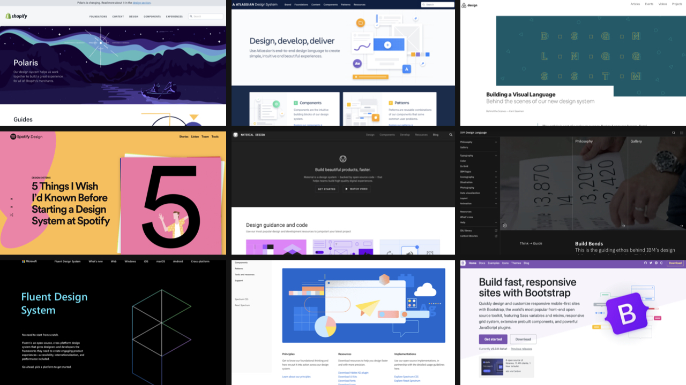

If you’re in UX — or even just UX adjacent — it’s hard to escape the concept of a “Design System.” It feels like everybody’s making one. Maybe you’ve made one. Maybe you are giving a talk about one!

And, really, it makes sense. A lot of work, a lot of dialogue, and a lot of good thinking in our community is being shaped by the need for systems that stretch the value of our work across lots of different projects, not just individual creative artifacts.

---

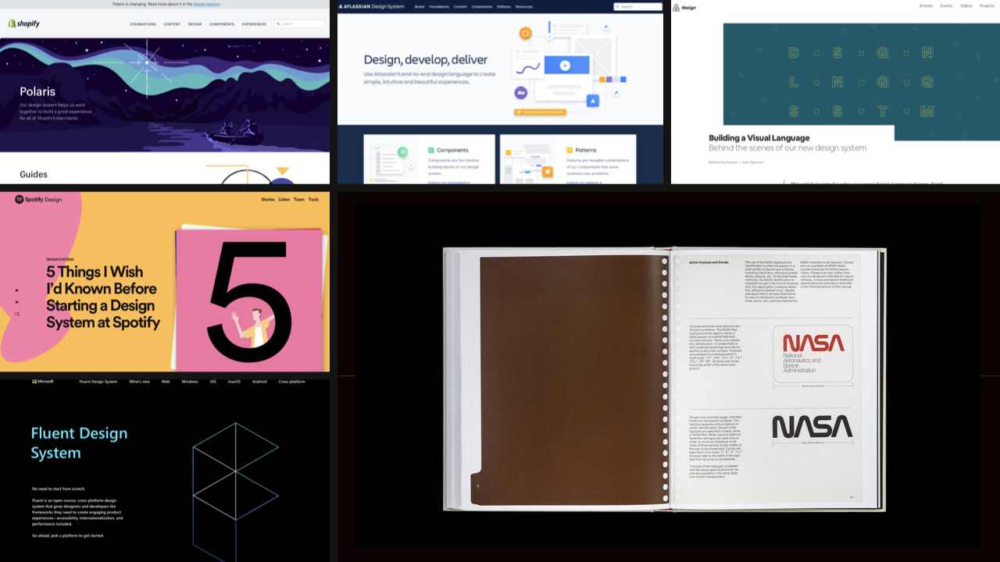

Depending on how liberally you define it, orgs have been doing that kind of work — in particular, standardizing the aesthetics and the structural elements of their designs — for decades. I’m a big fan of design ephemera, and NASA has made their “graphics guide” from the 1980s available as a PDF. It’s glorious.

---

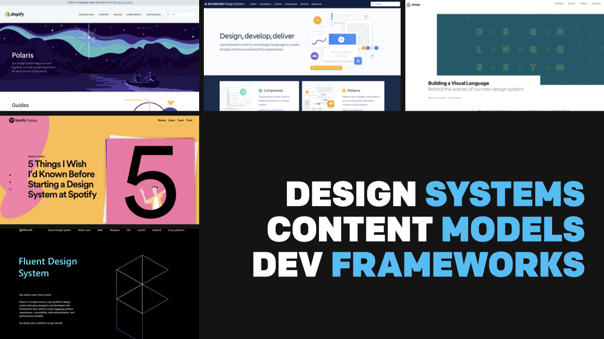

A lot of the same ideas have been shaping the content strategy and software development communities — both front and back end — for years, too.
The idea of breaking down the work we do into component pieces, standardizing them, and using that to improve the ways our teams work together, is pretty significant.

---

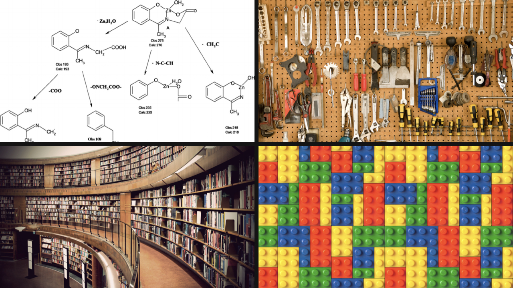

Now, I’m a big believer in the importance of metaphors. The concept of modular, reusable work shared by different people and different projects isn’t necessarily intuitive. No metaphor is perfect, but they help us understand complicated ideas using ones we already grasp.

And as a cluster of industries, we use a LOT of different metaphors to talk about these component-filled systems we create.

---

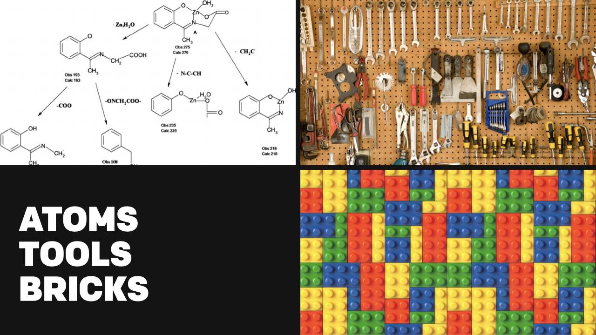

This is something that interests me: a lot of our metaphors focus on what we call the individual elements in those component systems and how we organize them. Atoms and molecules. Toolboxes full of tools. LEGO bricks we build things out of.

They all shed important light on the nature of the work we do and what we need from our systems. All of them get awkward in different ways. But today I want to zoom in on one in particular.

---

That metaphor is language. The idea of a “Design Language” has been around for decades in product companies like Apple and Mercedes-Benz; my background isn’t really in design, so it probably goes back much farther, but it certainly goes back at least that far.

Even beyond visual design, it’s common for people in a bunch of different industries and disciplines to talk about the “shared vocabulary” that designers, developers, content managers, and so on use to communicate effectively with each other.

The language — or “vocabulary” — metaphor for component-oriented systems is useful because a lot of our work relies on that collaboration across teams, disciplines, and organizations. By definition, that cross-team collaboration requires communication — and if you’ve got communication, you’ve got language. The “shared vocabulary” becomes both a tool for coordinating everyone, and an artifact after the coordinating is done — a kind of glossary of the way the team solves problems.

---

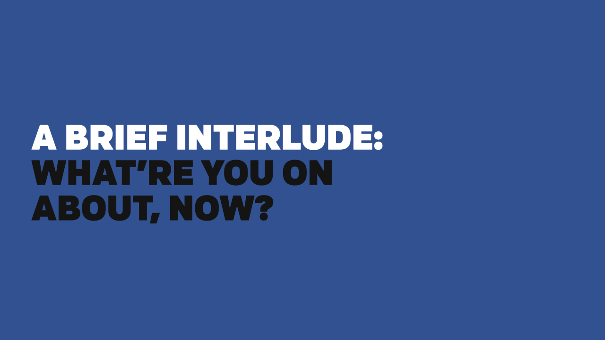

Now… I need to offer a caveat before we proceed. This is a fairly abstract talk. It’s not a tutorial or a quick trick or a New Model To Accelerate Your Anything.

It’s more of a peek at some evolving perspectives, a look behind the curtain at what some colleagues and I are chewing on these days. It’s been useful for us, and I hope it will be thought provoking for you. But don’t take it as gospel, just the start of a conversation.

---

The colleagues I mention are Karen McGrane and Ethan Marcotte, my partners at a consultancy named “Autogram.”

That idea of communicating across disciplines is near and dear to our hearts. I come from a software development background — years in the .Net enterprise minds, more than a decade in open source CMS development, and then a hard shift over the past decade or so into content architecture and digital strategy.

Karen is one of the OG Crew of IA, digital design, and content strategy. And Ethan is an incredibly gifted designer and developer who coined the term “Responsive Design” in a decade ago, when people were still very serious about tables everywhere. The fact that we can talk to each other at all is a testament to the value of a shared vocabulary.

We usually work with clients big enough that without systems — without the shared vocabulary — their teams would grind to a halt. Occasionally we work with clients whose projects already have. And while there’s incredible value in that vocabulary, over the years we’ve realized that it’s not quite enough.

---

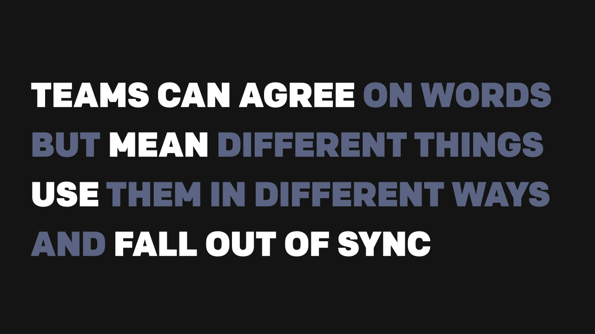

Teams can agree on words, but still mean different things, use the words in different, conflicting ways, and fall out of sync… sometimes without even realizing it until the collisions cause huge problems.

You can get everyone to sign off on the approved list of patterns, name them and document them, ship the React components, and in three months — inevitably — discover that they’re using half of those components for radically different purposes. Customizing them in different incompatible ways. Turning your wonderful “vocabulary” into a tower of babel.

---

This is, I think, my absolute favorite photograph in the entire world. I took it at the grocery store years ago, and I will work it into every presentation I can.

Some people notice it immediately, some people don’t see the problem… but the labels on those four cans are “Turkey, Chicken, Duck, and Kitten.” One of those things is — hopefully — not like the others. Its presence turns what could have been a very straightforward selection of flavors into a taxonomical — or ethical — dilemma.

What I really love about this collision is that it’s a problem we see in client’s design systems and structured content models. Someone creates a “CAN” component, names one of its properties “VARIETY,” and calls it good. Six months later everything’s going fine… until someone makes a STACK OF CANS component that puts them all next to each other, and everyone discovers how many different ways “Variety” can be interpreted.

---

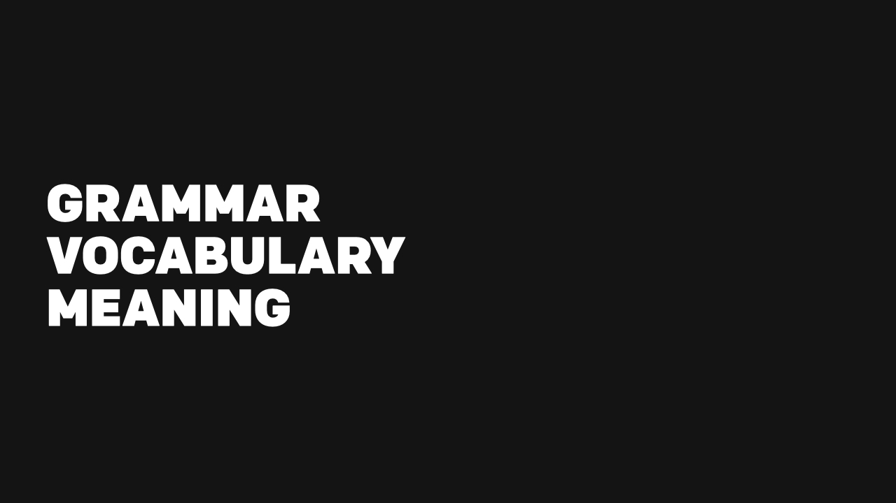

If we go back to the language metaphor we started with, this gets interesting. Because in language, a vocabulary doesn’t stand alone: the “lexicon” of a language is only one piece of the puzzle.

Words require a supporting structure — a grammar — to be combined into meaningful messages. And talking about “meaningful” messages implies that everyone agrees on the underlying semantic intention of the words, not just how they’re written or what they sound like.

---

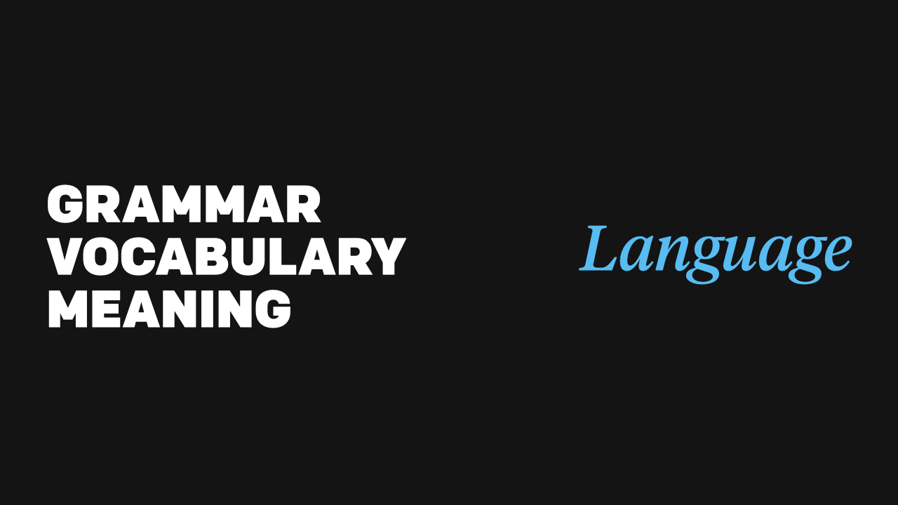

Apply that to something like a front end pattern library, and the failure of vocabulary-only approaches feels a little less confusing.

“VARIETY” may seem like a good enough name for one of the text properties in a React component. It isn’t inaccurate, everyone agrees on it, it even matches the CMS we’re using to populate the components! But the team also needs to agree on more than a name — they need to understand the intention, and how that property will ultimately be used, what other properties everyone imagines it will be combined with. Is “variety” the flavor of the food, or the kind of animal that should eat it? Should “Title” contain the title of a book or the title of the article that reviews it?

Asking these questions, approaching these common problems using the metaphor of language and taking its nuances seriously, has helped us get a number of stuck clients over the conceptual hurdles and shed new light on the issues they’re facing.

---

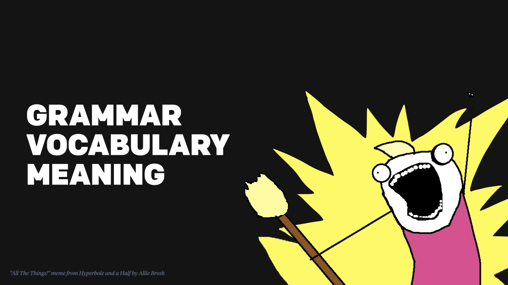

Now, I don’t know about you, but that’s the kind of “aha moment” that makes me want to nerd out.

A couple of months ago after walking a client through one of those “Aha” moments, Karen and Ethan and I started asking, what would it look like to take this ‘language’ thing seriously? What other insights could we find by looking at our pattern libraries and our design systems and our content models through that lens?

Well, friend. Let me tell you.

---

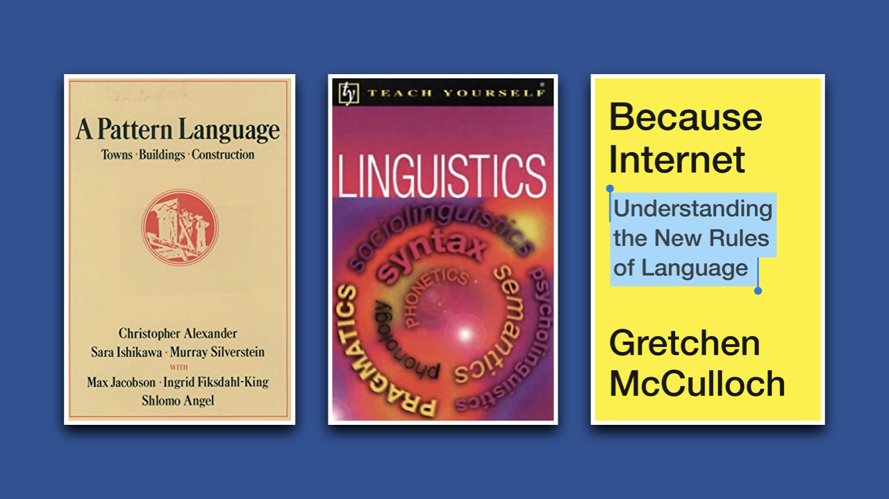

Again with the caveats. We’ve been diving into a lot of really interesting material about language, and the study of it, and how people interact with it and how people in other disciplines have applied it in the past.

But none of us are linguists, and doubtless a linguists who will hears this will say, “Sir, I object, you’re giving people the wrong idea about our field!” That’s likely. This is a talk about design systems and content systems and component software framework. The linguistics is just along for the ride, and shouldn’t be blamed.

---

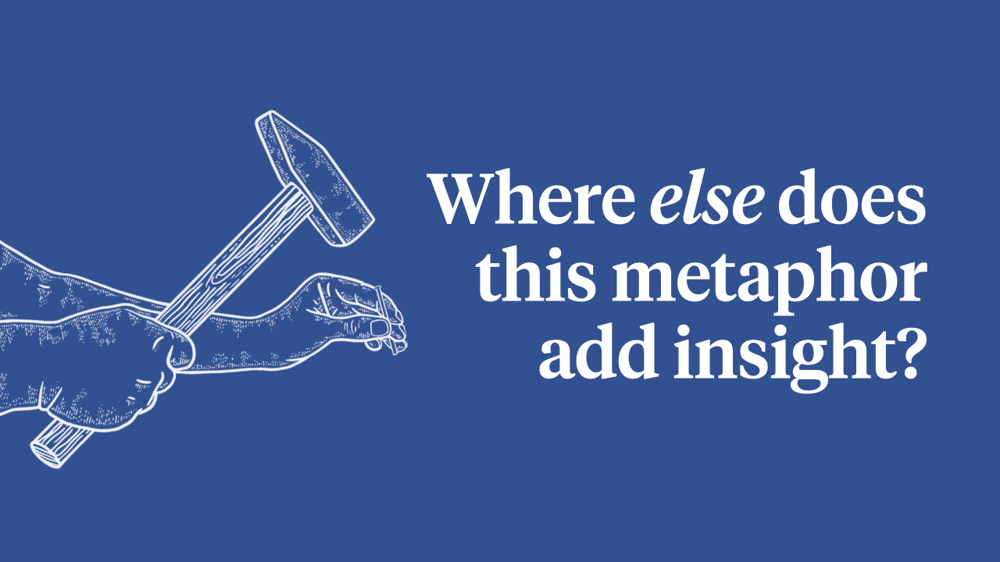

With that set of caveats out of the way, though, on to the fun stuff. What kinds of thorny problems did we find made more sense through the metaphor of language?

Given our fun new hammer, what nails awaited us?

---

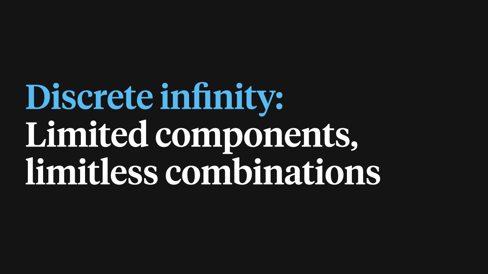

In linguistics, Discrete infinity is the idea that language has a limited (discrete) set of components — phonemes, words, all that stuff — but infinite potential for novel combinations. English has a growing but finite number of words. The magic comes in how people take that set of words, within the bounds of the grammar, and use them to build unique messages.

One of the problems we see a lot in design systems and content models that have been used “in the wild” for more than six months or so is the endless multiplying list of components to handle “special needs.” An effective design system or content model leans more on new combinations of existing things than new things for every need.

Boom. Synergy.

---

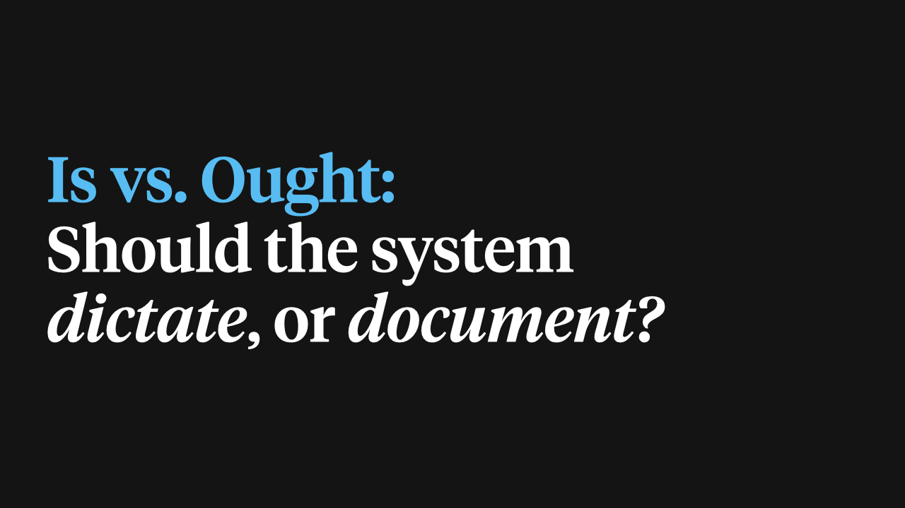

When teams use a design system to bring order to a bunch of disparate efforts, one of the questions we’re usually asked boils down to, “Should we just capture all the stuff that’s being done in the wild by our designers, or come up with a big rulebook and then enforce it?”

Both of those are a little extreme and no one seems happy with either one, but it’s a tension that’s almost always there.

---

Linguistics sees the same tension. It’s the prescriptivism vs descriptivism divide. One school of thought is that proper language has a set of hard and fast rules, and anything that violates them isn’t a proper part of the language. If your social sharing card doesn’t have a tagline, it’s not a proper sharing card and you can’t use it.

The other school of thought basically sees the job of a linguist as documenting the reality of how the language is used. They’re not anarchists — they believe there are rules that people use to determine whether something is “correct” or not — but those rules are often informal and fluid. They reflect what is effective and acknowledged in everyday use, rather than how it is specified by authorities.

---

This is all real merch from the “Lingthusiasm” podcast, by the way, which is glorious and excellent.

What’s useful about this idea, though, is that linguistics doesn’t need the decide which approach is right. Grappling with the complexity of a language involves a degree of both — describing real-world usage, and prescribing correct standards, at least for certain contexts. Recognizing that they’re two angles of approach, two different ways of looking at a larger system of communication, helps us explain the strengths, weaknesses, and complimentary qualities of both.

---

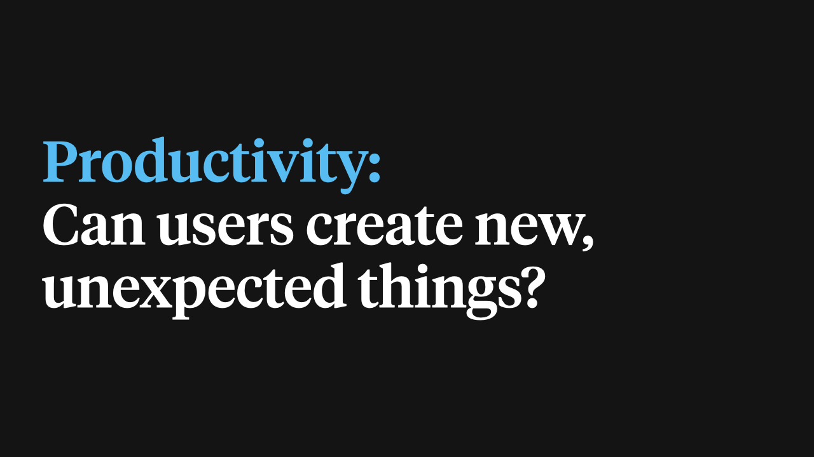

Productivity is in the same neighborhood as Discrete Infinity, but gets at a slightly different principle. Basically: Can the symbols in the language be combined creatively, to communicate previously unimagined messages?

---

To explain one metaphor with another one, a jigsaw puzzle is a “componentized” picture; it’s broken up into little bits that fit together. But you can’t use it to make a new picture, at least without breaking the “grammatical” rules of jigsaw puzzles.

---

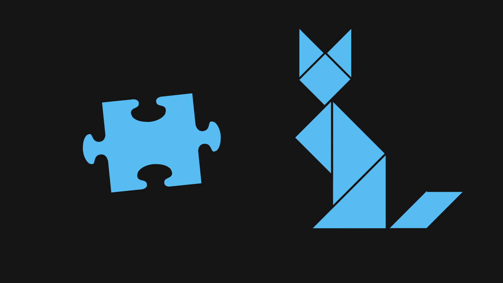

A tangram puzzle, though… that’s another story. Its pieces are explicitly meant to be rearranged and combined in different ways to produce different shapes.

---

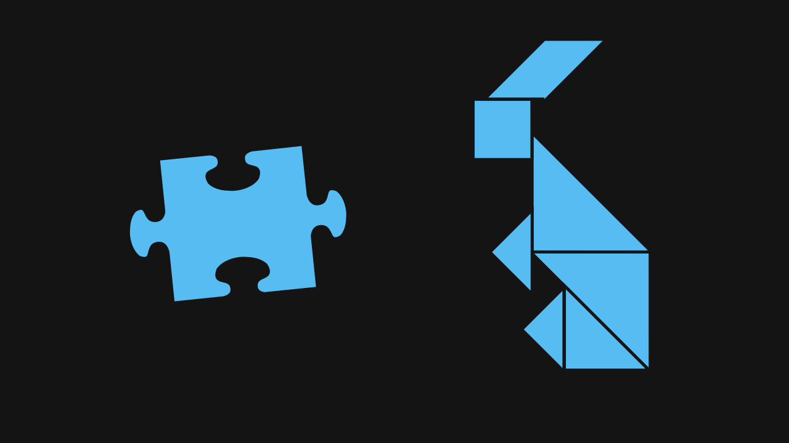

Design Systems and content models with a lot of “jigsaw puzzle” components may seem fine as long as you’re building out the thing they were planned for. But if you can’t figure out how a component would ever be reused — or the majority of your components are hyper-focused and difficult to adapt to other contexts? Your system will struggle long term and keep accumulating more, and more, and more…

---

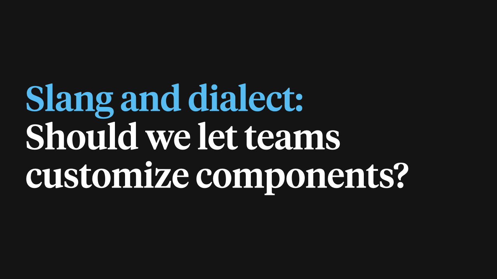

We’ve never seen a design system or content model that didn’t have to deal with exceptions — teams that needed to add fields or override behaviors or make variations on the accepted, standard versions of things for their project or product. Organizations tend to either freak out, try to stamp it out and fail… or give up, shrug, and accept that the whole “consistency” goal is a loss.

Rather than treating these pockets of unique usage as broken-ness, though, looking at them as unique dialects, or maybe regional slang, can frame things less combatively. Teams still need to figure out when to absorb those things into the mainstream — if Fetch happens, will it appear the dictionary or will it stay on the margins? — but it doesn’t have to be cause for alarm. Often, it’s where the next big emerges.

---

Okay, here’s where it gets kind of wild.

There isn’t really time to get into the details in this talk, but this particular scenario is one that we’ve found more and more frequently, especially in big marketing organizations and midsized marketing sites.

---

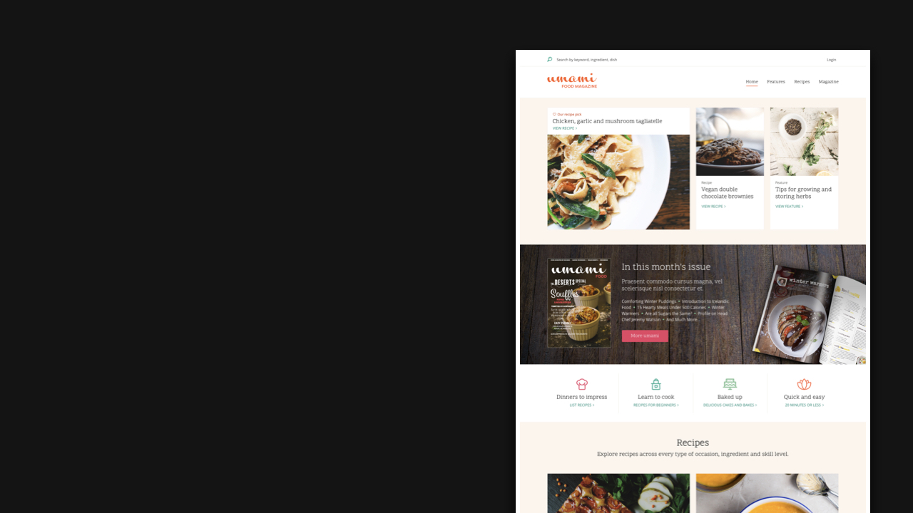

I’ve heard people talk about this as “The Landing Page Problem,” or “Rich longform content” or they just set up a Squarespace account or use Gutenberg. The problem bites teams when they produce enough material to need the rigor of a good content model and consistent, modular design… But their page-by-page, interaction-by-interaction needs vary so much that they can’t rely on traditional templates like “Article” or “Interview” or “Event.”

A common solution to that is to give people a kind of “catch-all” content type with few real properties of its own, but the ability to act as a container for smaller components like cards, hero rotators, link lists, rich text…

It can work, but doing it well requires that you build useful rules around what components can be used where, which combinations are valid, stuff like that. And it requires training the content editors to understand not just what various modules look like, but what their communication intent is, so that design tweaks in the future don’t result in a Kitten-Flavored Cat Food situation.

---

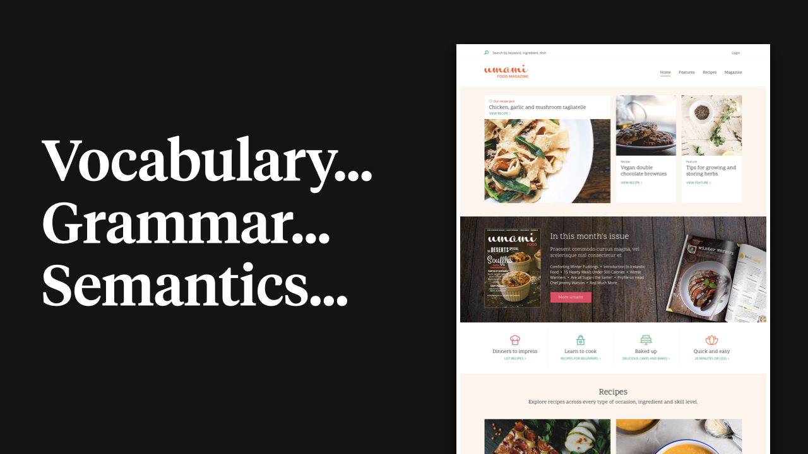

And… oh, my.

That means you’ve got vocabulary, and grammar, and semantics…

Now your modular content is a language you use to communicate with your end users. Ineption!

---

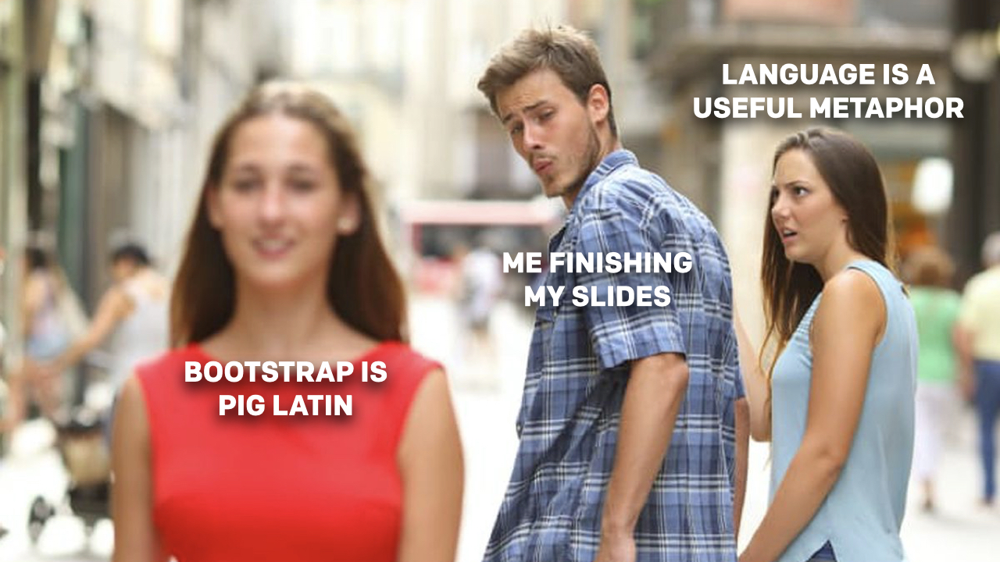

I am pretty sure this might be where Karen and Ethan say I am, quote, “back on my bullshit.” But we do what we do to get by in these troubled times. Find your happy place.

---

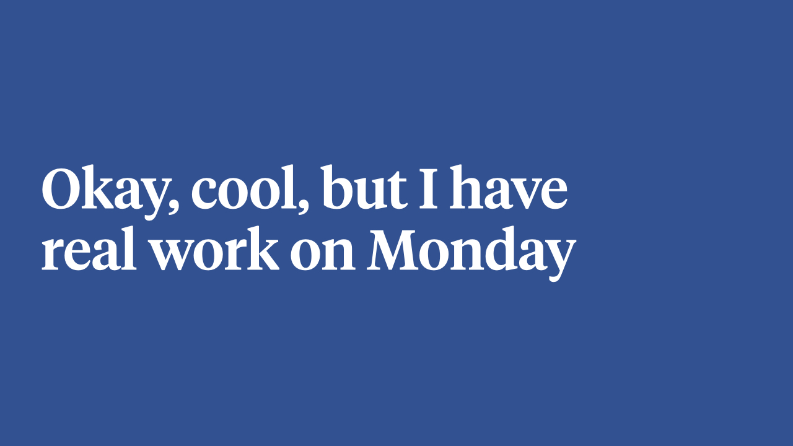

Okay, so. We’re running out of time and I’ll dial it back. Get us back to some traditional takeaways.

If you work with communications systems — content models, pattern libraries, design systems — what ideas can you take back and apply practically without making a conspiracy theory wall to explain it?

Right now, I’ve got two.

---

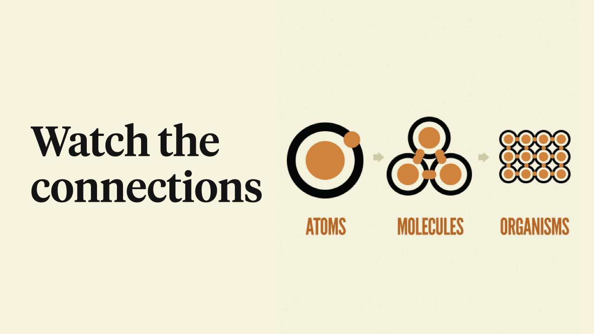

First: invest in the connections between things.

I’m a little too fond of using Atomic Design as my example of a grammar-less vocabulary for component design. Brad Frost is pretty explicit that it’s a starting point, not a magic wand, but a lot of teams start and end with the idea of defining their atoms, their molecules, their organisms…

And then get frustrated when that vocabulary doesn’t capture the interactions we’re talking about. If you and your teams are hitting that point — with any system, not just atomic design — it’s worth spending time with how the components connect to each other… both technically, as code and visual elements… and conceptually, as building blocks in your designers’ and team members’ heads.

---

Pushing ahead with the idea of atoms and molecules, caffeine is a molecule near and dear to our hearts. it’s not just a pile of hydrogen and carbon and nitrogen and oxygen. It’s those things arranged and connected in a very specific fashion — and a very specific set of potential interactions implied by the connection points at the edges that remain unused.

---

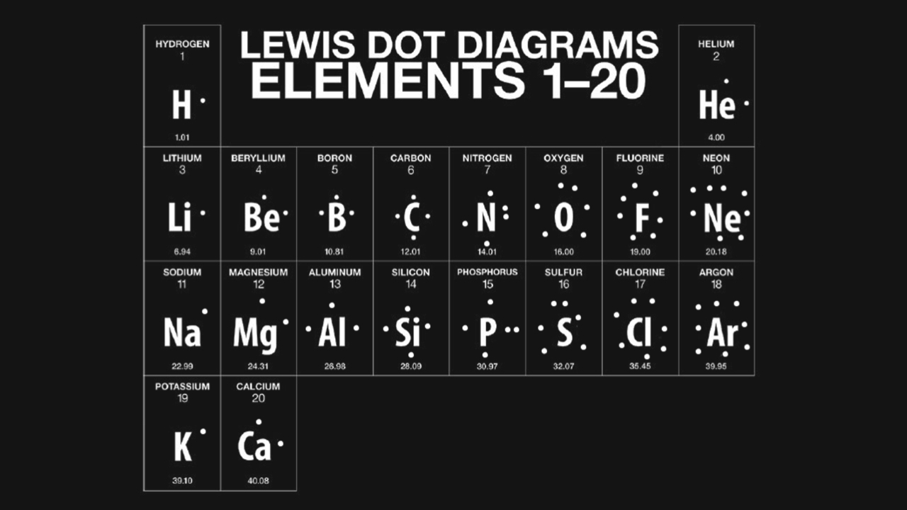

That style of notation isn’t random or ad hoc — and depending on how much attention you paid in high school chemistry you might remember it as “Lewis Dot Notation.” It’s an explicitly designed language for talking about the links hold molecules together. It’s the grammar of atoms.

Oftentimes — even if you’re working with a system you think lacks them — looking closer at the connections will reveal some kind of meaningful grammar, and teasing it out can help you make progress.

---

The other takeaway flows out of that attention to connections is the importance of system-level consistency, not just component level consistency. The way components connect to each other in a system — the grammar it uses to govern its pieces — can have farther reaching impact than any individual component. Because if you mess those rules up, changing them breaks all of the components, too.

From a language perspective, it sucks if the word “apple” vanishes… but it’s a lot worse if the concept of nouns goes away entirely.

---

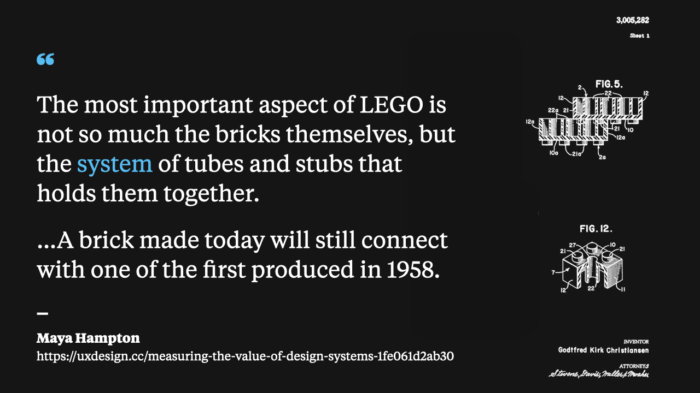

Maya Hampton wrote an excellent article last year that’s partially about measuring the business value of a design system, but also about the nature of systems — how the consistency of their rules is what keeps the system valuable even as the individual pieces change and evolve over time.

“The most important aspect of LEGO is not so much the bricks themselves, but the system of tubes and stubs that holds them together. …A brick made today will still connect with one of the first produced in 1958.”

---

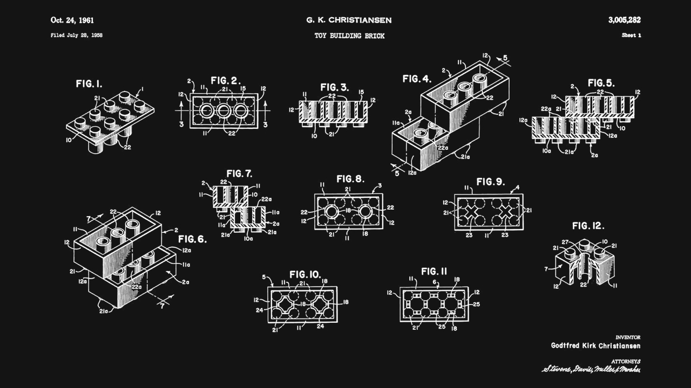

As you exaine the rules of your system, the ways things connect with each other, ask yourself what other kinds of pieces could play by those rules, even if you don’t yet need them yet. When you throw hypothetical curveballs at your system, can you figure out how to fit good answers into its rules? Or would you have to toss everything and start over?

It’s impossible to plan for everything, but considering how much room you have to grew and what would have to break is important.

---

Finally, if this idea of “treating the system like a language” intrigues you, keep digging. We’ve found it valuable, especially for those teams that deal with lots of high-variation content… but as far as I can tell this idea hasn’t been discussed much.

It’s a perspective, not “A System,” and other perspectives would be great. Lessons from other teams and examples from other systems can help us figure out if we’re onto something fundamental, or just polishing the edges of one more incomplete metaphor.
