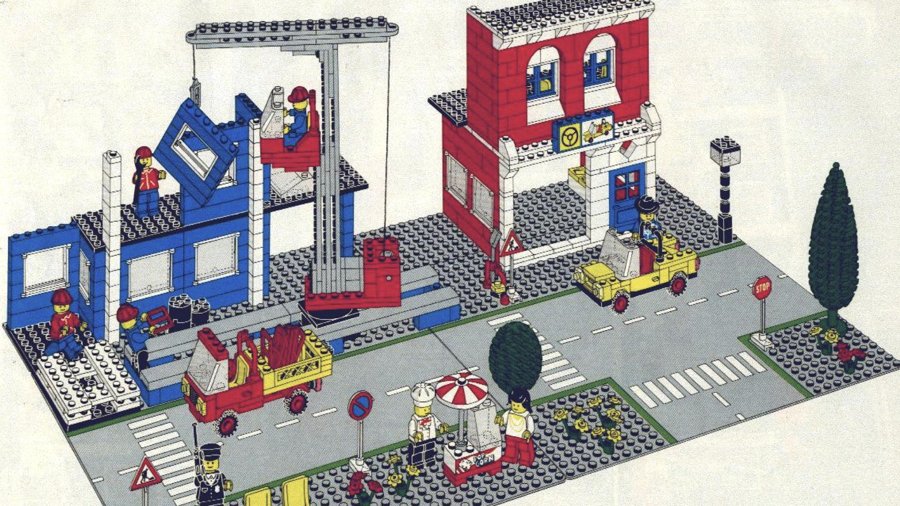

First off: I love LEGO. I’ve been training for this talk since roughly 1983, when I got my little hands on Set #6390 — LEGOLAND Main Street. I was a particular fan of the little chef down at the bottom, with his jaunty hat and popcorn stand.

But what really made it amazing was the way it worked. That little car parked on the right side of the picture?

---

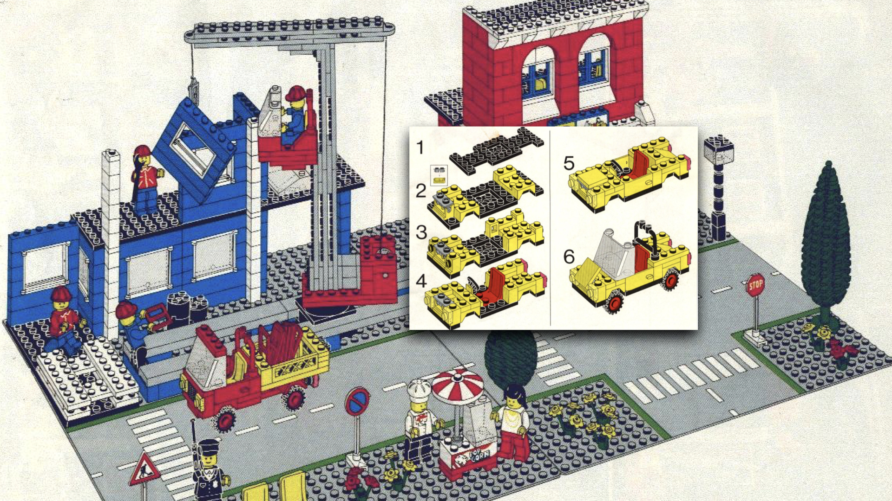

If I didn’t like, it, I could just change it. Or tear it apart and build something else entirely! It was a toy made of toys that could make other toys.

That’s how LEGO works, and it for kids that really loved it, the practice of looking at every new LEGO set to figure out what pieces it used, how particular parts had been assembled, and how it could be altered, became a deeply ingrained habit. I think that shaped the way I look at problems, and the tools I use to solve them, for the rest of my life. I don’t think I’m alone in that, either.

---

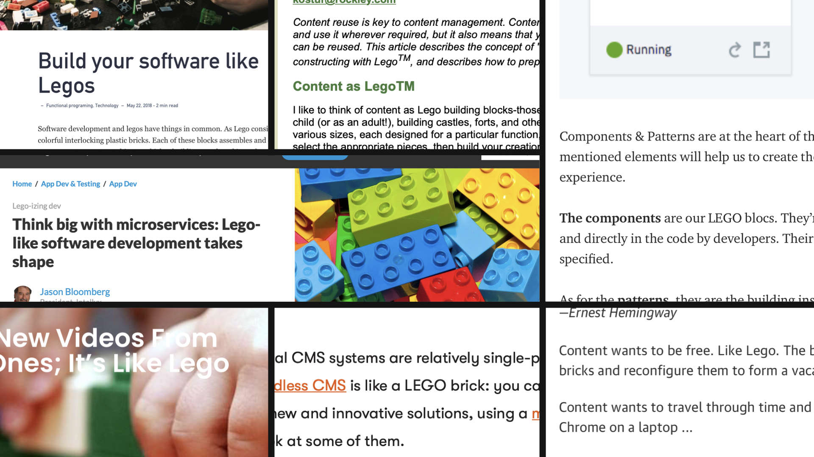

LEGO isn’t just tremendously popular (they sell roughly 75 billion plastic bricks each year). It’s also the go-to metaphor when our industry needs to explain any kind of complex, component-oriented system — from structured content to object-oriented programming to pattern-oriented design systems. “Do you need flexibility and reuse? Break things up into bricks, then build new things out of it!”

Now, as much as I love LEGO, that trend has worried me. Because the quick, easy building block comparison can help people understand some key ideas, but it can also obscure the real complexity of creating and working with complex software, design, and content systems.

---

At Autogram, the agency I co-founded with Karen McGrane and Ethan Marcotte, we focus on complicated, large-scale content and design systems, and I can say wholeheartedly that "use components, that will solve it!" is not an answer to most of the problems we see.

If our sole focus is on the components themselves, the individual pieces our content is constructed from, the final product will be pretty chaotic. The magic of LEGO isn't just that big things get built out of small things. The magic is that those small pieces all work together consistently. And that's harder than it looks.

---

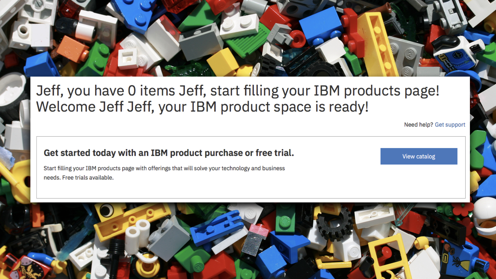

This is a screenshot from the IBM Products and Services Dashboard, where you log in to control your various subscriptions and product licenses. It’s silly when you look at it, but every individual bit of content was written to be friendly and human. The problem is that clicking those bricks together doesn’t make a coherent whole.

Honestly, most of the work we do isn’t cutting edge, infinitely remixable, AI powered content. We’ve got simple problems like “making search work” and “keeping the pricing page organized” to keep us busy. But I love talking about machine-generated content, personalization, chatbots, and those kinds of applications for a simple reason: they make it very hard to hide the “seams” where different pieces of content have been jammed together. That happens in simple applications, too, but it’s particularly hard to hide when we’re assembling words. Because the rules of language are complex, and most of people apply them unconsciously.

---

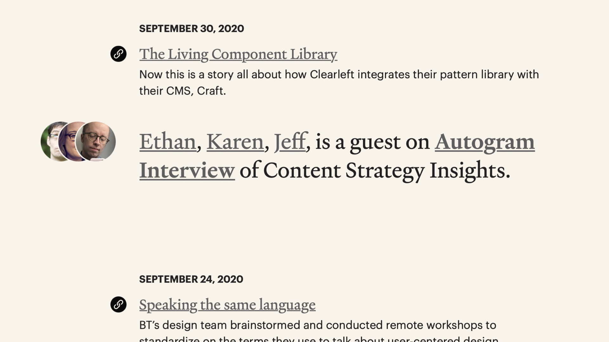

When Autogram rolled out a new version of our site earlier this year, we wanted the news feed of links, interviews, and so on to feel “conversational.” But when we built the templates for the press clippings we’d assembled, the results were awkward. Wrong, even.

The modular, structured content we’d created broke up every press clipping into easily remix-able data, but just jamming the pieces together again didn’t work. We could have written all of the text for this page manually, but that would’ve made it impossible to reuse the structured data in other locations.

---

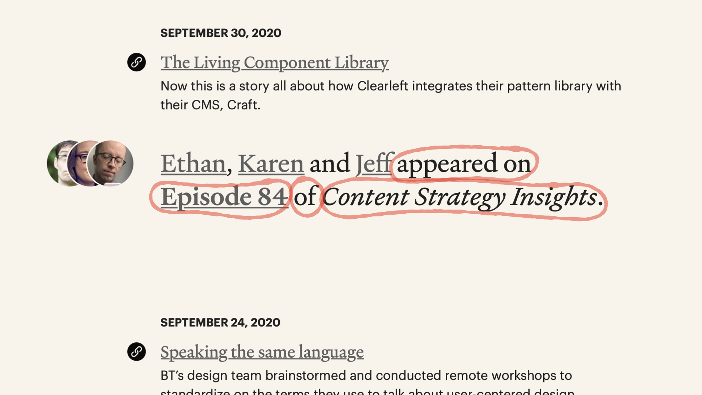

There was no easy automatic solution; in the end we created a system of metadata to describe what kind of thing a link represented, what kind of venue it appeared in, and so on — then tested the different ways we knew we’d be using the data to ensure it could produce good results.

1. A person appears in a film, appears on a podcast and appears at an event…
2. An interview can be an episode of a podcast, but an event at a conference.
3. Certain kinds of venues are italicized.
4. And sequential media, like issues of a magazine or episodes of a podcast, should be referred to by number instead of title, even though we used the full title in other contexts.

All of these things were fussy, but that’s how language works. And to make our content work, we had to plan not just how we would break things down, but how we’d put them together again.

---

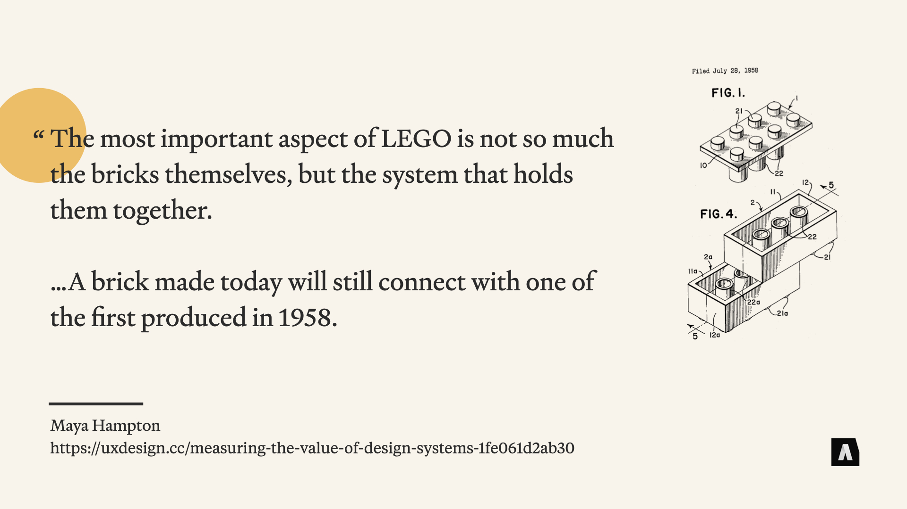

Maya Hampton wrote a fantastic post about design systems last year about this very idea.

“The most important aspect of LEGO is not so much the bricks themselves, but the system that holds them together. A brick made today will still connect with one of the first produced in 1958.”

To build a system that works, we have to consider the whole system that binds the pieces together. That’s what I mean when I talk about the “Language” of LEGO — the rules and principles that make the pieces work together, so they can be used to build new and meaningful things.

---

## Consistent connections

The first principle we’re going to look at is the underlying system of rules and shared properties that makes LEGO work consistently.

Playing on the language metaphor again, I think of it like the “grammar” of LEGO. Individual words form a vocabulary, but the invisible rules that govern how they work together are just as critical — they’re the glue that holds a language together. LEGO is no different; the individual bricks get attention, but the consistent foundation is what allows 60 years of bricks to work together.

---

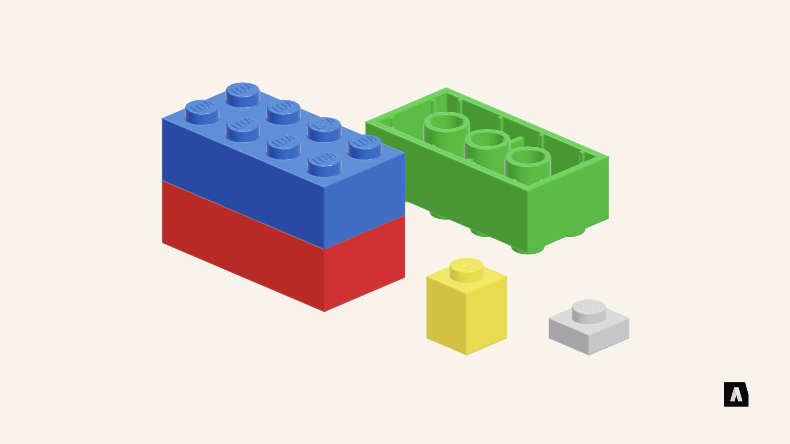

The LEGO system’s basic units of connection are the “stud” (those little round pips on top of each brick) and the “tube” (the bits on the underside of each brick that the studs snap into). They studs and tubes give just enough friction to hold bricks together without making them too hard to pull apart, and that system is part of the first patents LEGO filed in the 1950s.

Bricks are usually referred to by how many studs they have — those big ones are two-by-four bricks, and the little yellow one is a one-by-one brick. The tiny grey fella is a plate — and a one-by-one plate is basically the “atom” of LEGO, the smallest unit you can build with.

---

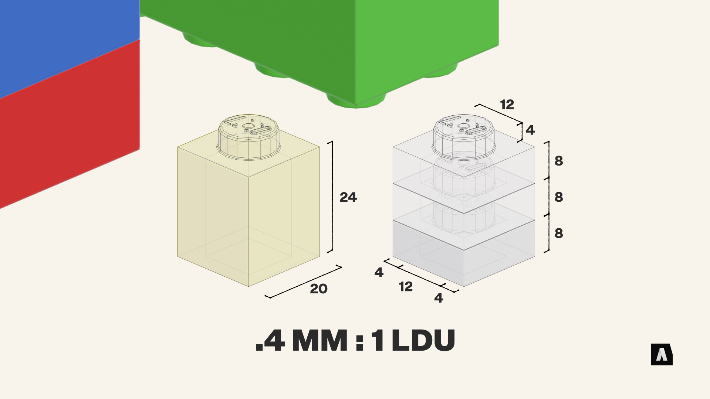

Now, here’s where it gets wild. There’s an even deeper underlying consistency beneath those relatively coarse “Lego Units” of studs and plates. The proportions of the pieces themselves are built around a “magic number” of roughly four tenths of a millimeter.

- LEGO enthusiasts call that measurement the “LDU,” short for “LEGO Draw Unit,” and it appears everywhere, like pi in geometry.
- A “brick” is 20 LDU wide and deep, and 24 LDU tall.
- A “Plate” is 8 LDU tall — three of them can stack to make a brick.
- A stud is 12 LDU in diameter and 4 LDU tall; conveniently, the same size as the tubes on the bottom of each piece.

---

## axles, hands, and headlights

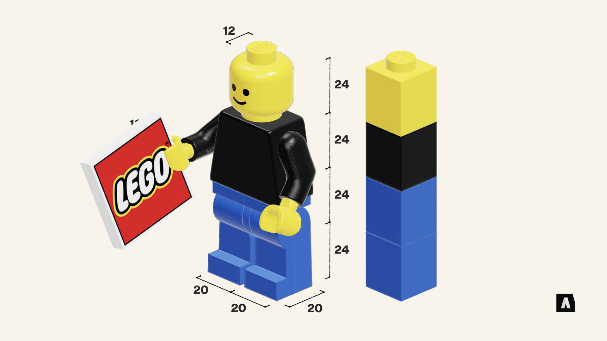

Even the LEGO Minifigure plays by the rules of the LDU.

Every minifig is three bricks tall at the shoulders , with a one-brick tall head — (96 LDU). Their feet are each 20x20 LDU — just like a brick. So they can “stand” on a LEGO plate. The peg on top of a minifigure’s head is a standard one — 12LDU in diameter. Its hand is 12LDU in diameter, too; the inner grip is 8LDU — the same as a LEGO plate’s height. And that means a minifigure can hold a standard LEGO plate — 8 LDU thick — in its hand.

---

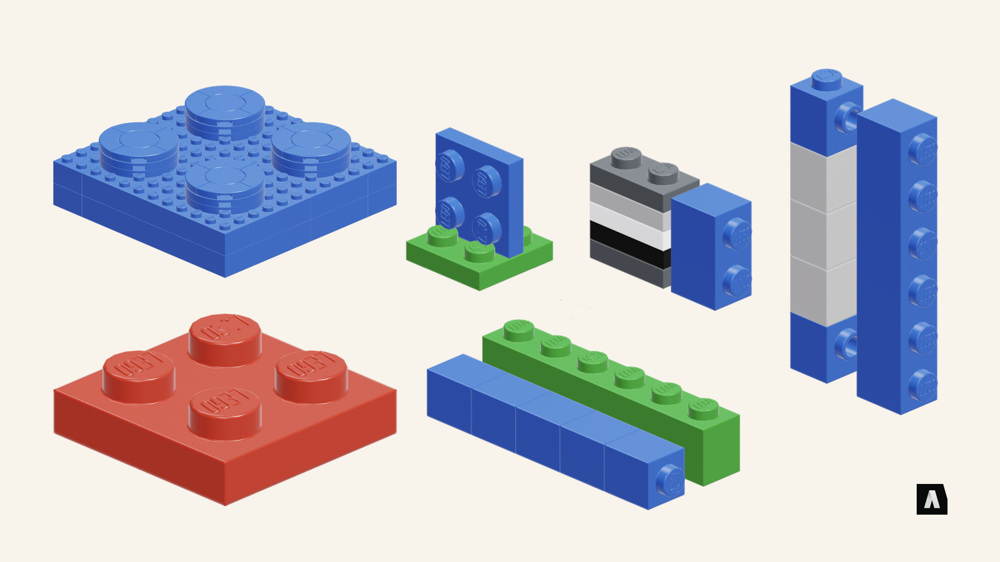

The consistency of the system isn’t just about the connections, either. It also reveals some deeply pleasing symmetry. You can build a big LEGO brick out of LEGO bricks, and the proportions still work. A plate (8LDU thick) can fit between the studs of another brick (an 8LDU gap). Five plates are as tall as two bricks are wide — both add up to 40 LDU, and five bricks laid end to end are as long as six bricks are wide — 120 LDU.

Taken together, LEGO builders have used the underlying order of the system to develop new ways of building and combining bricks.

The designers of the System didn’t have to plan and account for every one of these interactions individually — as the number of parts increased, that would’ve been impossible. They just stuck with the core measurements, ensured every piece could use the standard connections in as many ways as possible, and left the rest up to the creativity of individual builders.

---

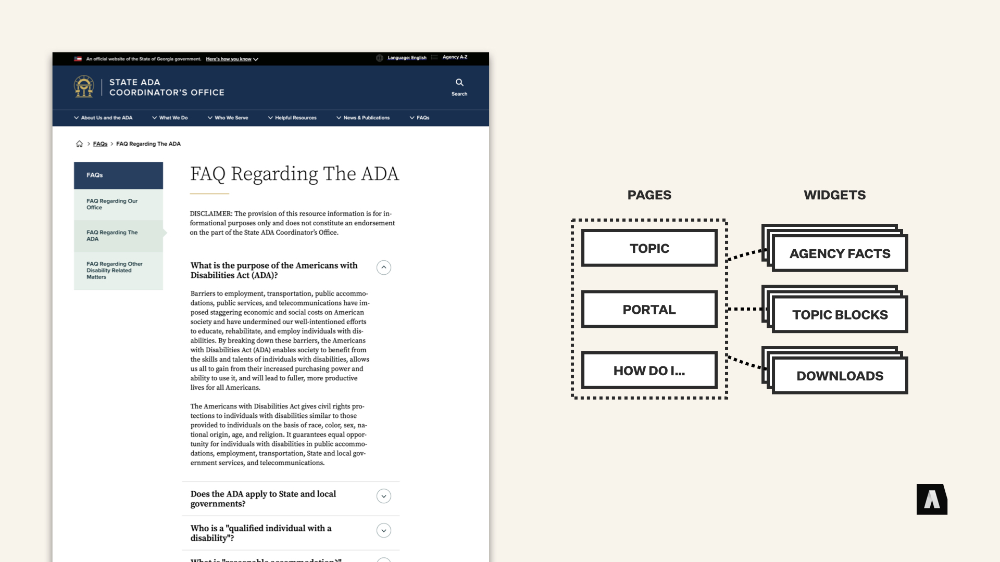

So, how does that play out in the world of content?

When the state of Georgia built a new content management platform for its 100 or so agencies, it had to come up with a system that would work across all of those different teams, for all of their messaging. There were a lot of twists and turns, but they stuck to some core principles with their content model.

Content was grouped into some very basic buckets: pages and widgets. There were lots of different kinds of pages, with different properties, but they had specific ways of connecting to the site navigation and each other.
And there were lots of different kinds of widgets, but they were always embedded inside of some kind of page. On textual pages, they were placed with embed codes inside the flow of the text. On portal pages, they were placed into specific “slots” in a defined layout, and so on.

They could add new kinds of widgets to meet new needs, and as long as they worked with those basic rules they would cooperate with all the other content types. And they could create new page types as well — as long as they followed the same interaction rules they could draw on the same library of widgets and interaction mechanisms as all of the other content types. Their system let them build around those rules without having to plan out every possible combination, and without imagining every possible addition they might make in the future.

---

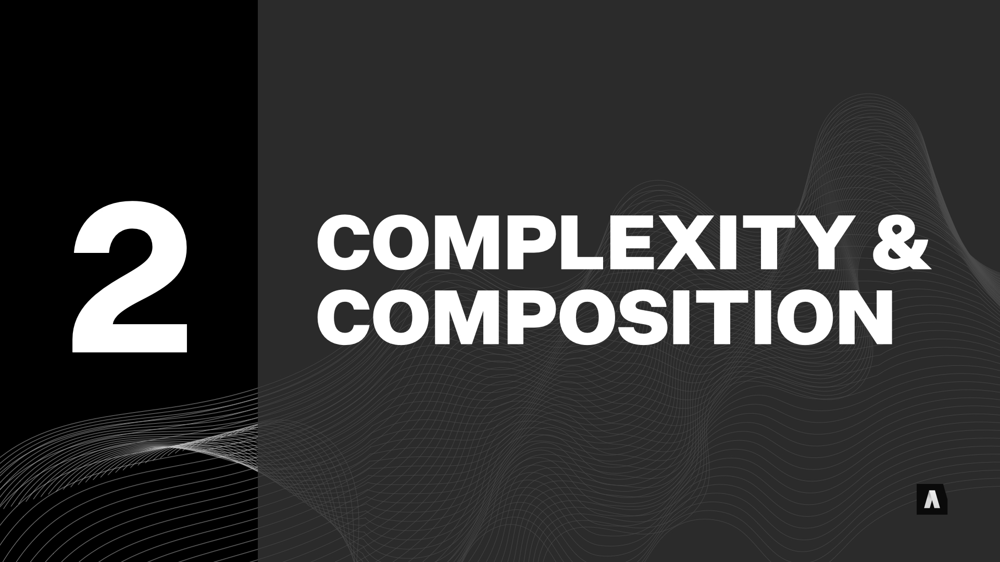

The basic promise of LEGO is that you can build amazing things out a limited collection of small pieces. There are about 3500 kinds of bricks (if you count all the variations), but the range of things that can be built is essentially infinite. The answer to a new building challenge — generally speaking — is not new bricks but new combinations of bricks.

---

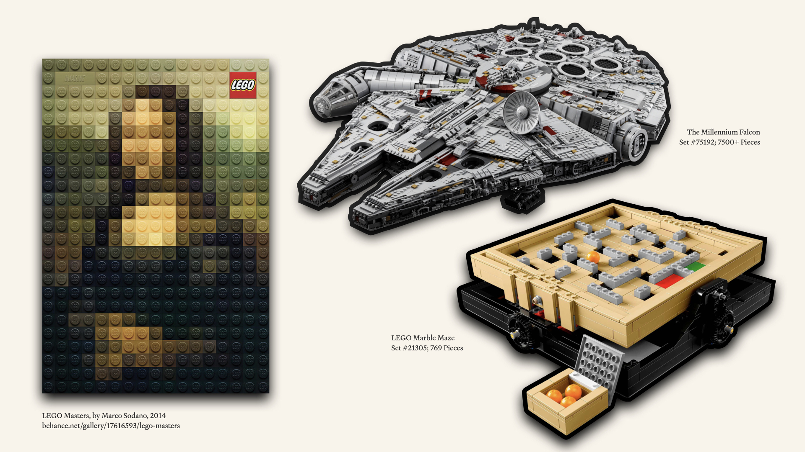

That philosophy, along with the studs-and-tubes connection style and the consistency of the LEGO Draw Unit, creates some amazing possibilities. From mosaic-like recreations of the Mona Lisa to meter-long space ships to working machines like the LEGO Marble Maze. I wanted to show a dazzling parade of different LEGO projects here, but… honestly, there are thousands of them, and people on the Internet love nothing more than showing them off. You should check it out.

This idea — of managing complexity by composing big things out of small things — has some deep roots in how we communicate, too.

---

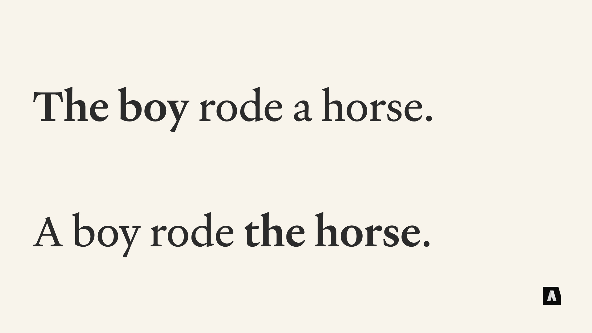

These two sentences use exactly the same words… but because of the conventions of English grammar and the order in which they’re arranged, they have very different implications. One is about a boy, the other is about a horse.

In linguistics, this principle is called discrete infinity. The idea is that a language has a number of discrete, self-contained units like words. They can be combined in an infinite number of ways using the rules of the language’s grammar, and together, they can express new ideas, or old ideas in new ways.

The expressiveness of language itself — its real complexity — is driven by those endless combinations.

---

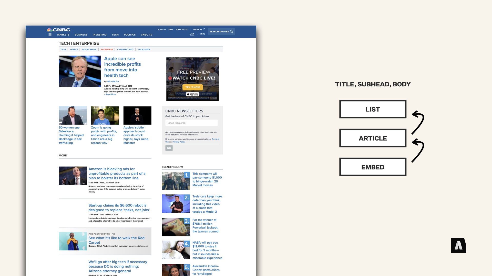

CNBC is one of my favorite examples of this idea. More than 15 years ago, as part of a major replatforming, they had the chance to create a new content model from scratch — and they decided it shouldn’t just be a set of content types, but a system that could expand.

So they started with the basics and built everything on a foundation: Articles, Embeds, and Lists. All three are guaranteed to have a Title, as Subhead, and some sort of meaningful body content, though what it is can differ from item to item — chart embeds render a chart, pull quote embeds have text and an attribution link, and so on.

There was a consistent system of relationships, too: Articles were the foundational unit of content for visitors; Articles could live inside of Lists; and Embeds could live inside of articles. Pretty familiar stuff for anyone who’s worked with a modern CMS.

---

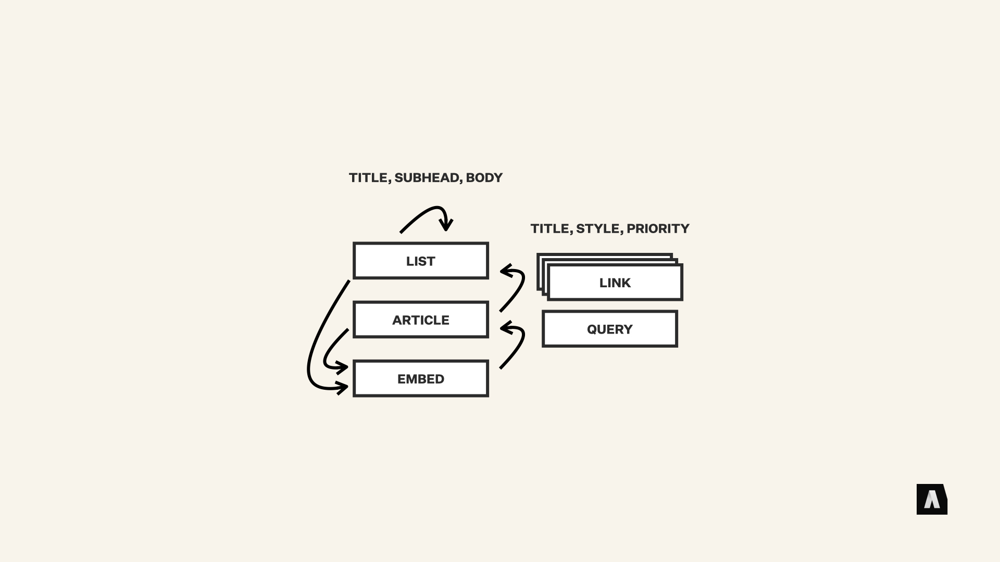

But the CNBC team spent some extra time on their foundations, and it paid off. Because Lists, Articles, and Embeds had a shared set of consistent properties, they could usually be substituted for each other.

An article could be used as an embed in another article, and it showed up as a teaser. A List could be used as an embed, making “recommended reading” and “more on this topic” displays very straightforward. And lists could live inside of other lists, too — allowing editors to build complex landing pages with different sections and subsections as “lists of lists.”

Soon they made some careful extensions to their system: the connections between articles, embeds, and lists were called “links,” and each “link” could contain a priority rating, a custom title, and some metadata with design direction, like “Make this pop”. The construction of their pages stayed the same, but that made it possible to give articles contextually-tailored headlines in specific parts of the site.

Eventually they made it possible to replace the manually curated list of links in a List with a “query” — a particular bit of content that only contained topic, time, and keyword information. Suddenly, editors could make archives or topical search pages, or even update a landing page to be partially curated, partially automated, with customized headlines. All without altering the underlying rules of the system, just by combining their basic set of parts in different ways.

This is probably the most important lesson that any of us can take away from the LEGO metaphor. You don’t have to anticipate every edge case or every emergent need, you just need to choose a consistent set of common properties and connection points for your content — and understanding where the “edges” that will need to click with other content live. With that kind of foundation, new content types and new editorial tools can add versatility without breaking old elements.

---

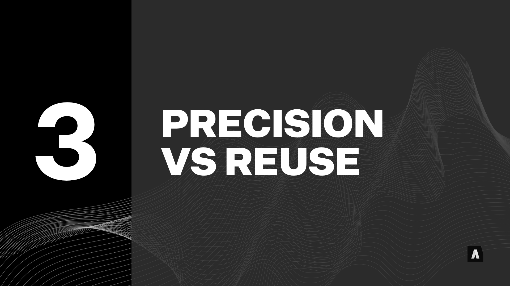

Now, I said the system of connections — LEGO’s “grammar” — was one of the most important takeaways, but this one is definitely a runner-up for my favorite.

---

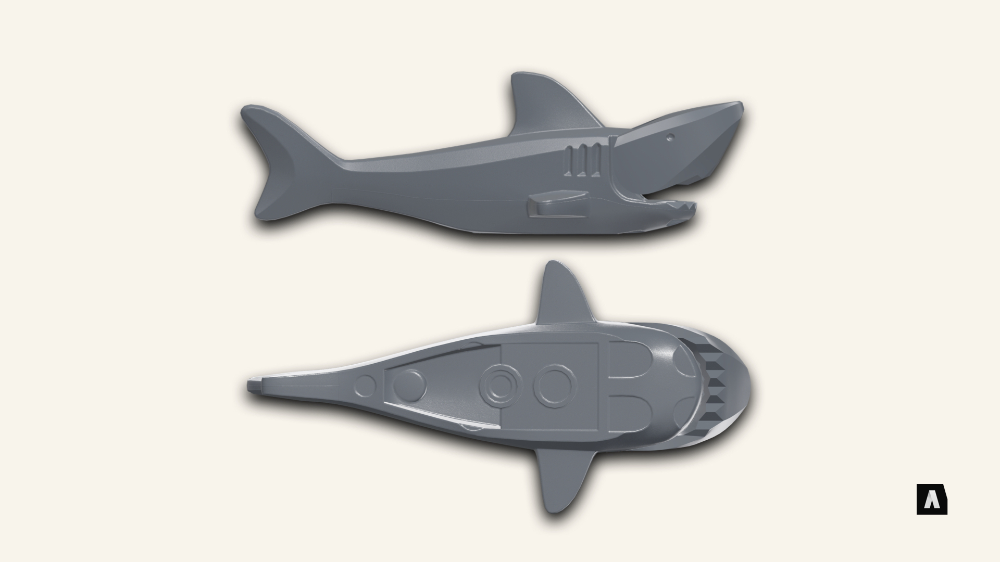

I think of it as “the shark problem.” The shark is a wonderful and delightful LEGO piece — they added it in 1989 for the first Pirate-themed LEGO set. It has tubes on the bottom, and you can connect it to a brick with studs… but it’s not like you can make anything other than a shark out of it.

One of the fundamental tensions of LEGO is the contrast between those special-purpose pieces that perfectly represent some object, and the generic pieces that can be combined to … well, get close.

---

In the LEGO building community, that’s called “brick-builtness,” the quality of being built from bricks. It feels like a very German way to name something. While “perfect pieces” can knock it out of the park when they’re needed, they don’t really play well with the “brickbuilt” philosophy. They can’t be reused. Neither option is good or bad, but there’s tension between them.

---

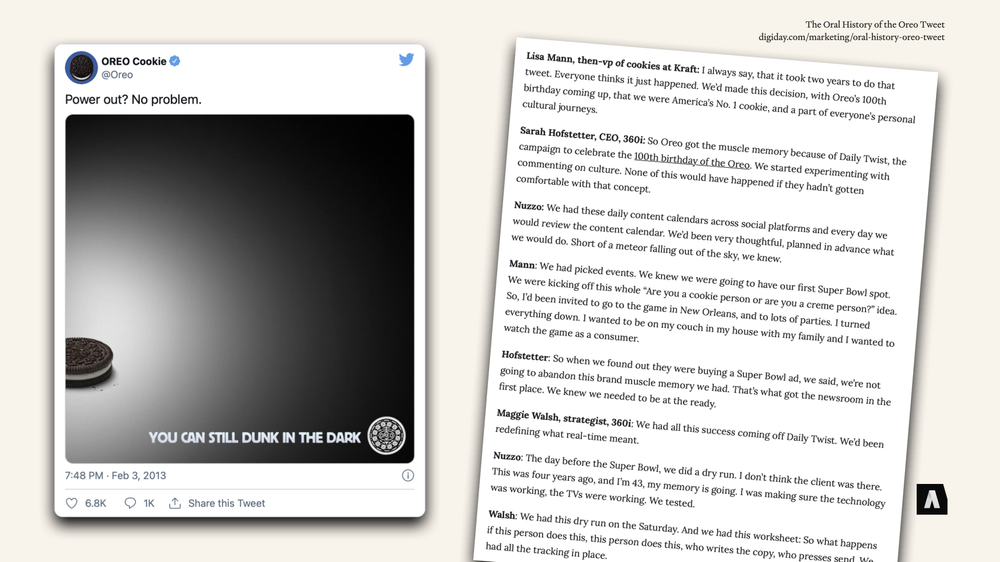

From a brand and communication perspective, highly-tailored messages can absolutely kill it when they’re used in the right moment. In 2013, during the Superbowl game, an electrical outage briefly cut off power to the stadium, killing the lights and halting the game. Oreo’s social media team seized the opportunity and dashed off a quick tweet: “You can still dunk in the dark.” Everyone loved it, it went viral, other brands aped it…

Later that year, Digiday even published an oral history of the tweet, Which I still find hilarious.

But. That never reappeared in Oreo’s marketing. It was the perfect content for one context, but it wasn’t something they could build around. It wasn’t meant for reuse. In larger component content systems, you’ll see this distinction as well: general purpose structures like “article” or “call to action” are used and reused in different contexts, but highly tailored stuff like a masthead or a heavily-customized landing page are only appropriate for very specific circumstances.

Both of those approaches their uses; a good system will balance them, relying on composition and reuse to fill emergent needs, and special-purpose structures when the payoff is worth the extra work.

---

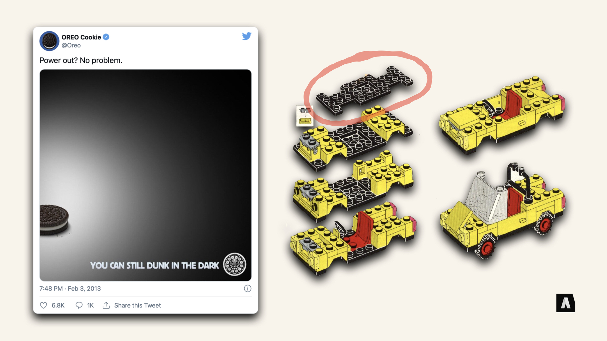

It doesn’t have to be an all-or-nothing choice between one-off solutions and reusable patterns, either.

If you build on the idea of compositional complexity, it’s often possible to identify just one spot where a special-purpose type of embed, or a unique display style for a standard article list, would let you build what you need with otherwise generic components.

If you think about it, as unique as the “Dunk in the Dark” tweet was, the overall communications system and content publishing pipeline their team established was still in effect; it was one piece of messaging that broke the mold, not a giant campaign.

---

## Sandboxed Subsystems

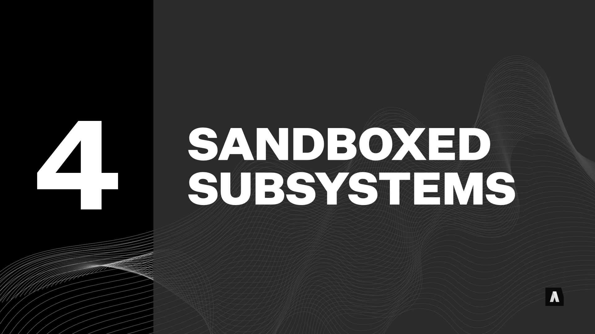

DUPLO and TECHNIC were two of the first “specialty” lines LEGO created; they used the same rules but went in different directions. DUPLO was twice the size of normal LEGO bricks, meant for toddlers and younger children. TECHNIC was for older model-builders, and added additional mechanisms like rods, gears, and connecting pins.

---

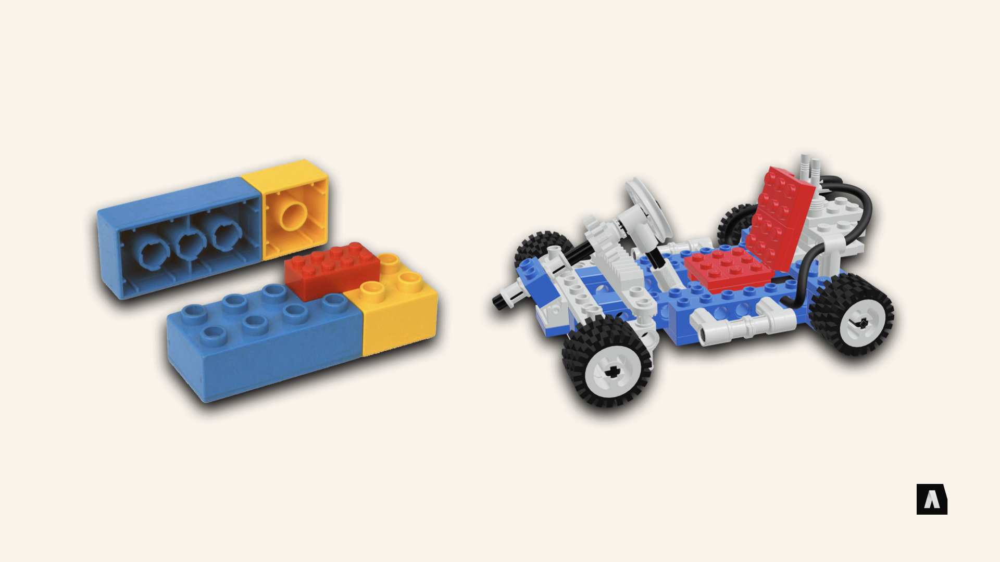

What’s worth noting is that both TECHNIC and DUPLO remained compatible with existing LEGO pieces — they added new mechanisms or scaled up old pieces, rather than departing entirely. That meant they could interoperate, but it also meant they could serve as a testbed for emerging LEGO techniques.

Quite a few of the practices (like DUPLO’s reliance on “perfect molded pieces” for complicated objects that would require small pieces, or TECHNIC’s extensive use of gears and levers for moving models) stayed in their respective sandboxes.

But other aspects have “escaped their sandboxes.” Technic style rod and pinion pieces are now common inside “normal” LEGO sets, for example. And many master LEGO builders use DUPLO bricks to fill in large structures like hills or mountains when making large LEGO dioramas.

---

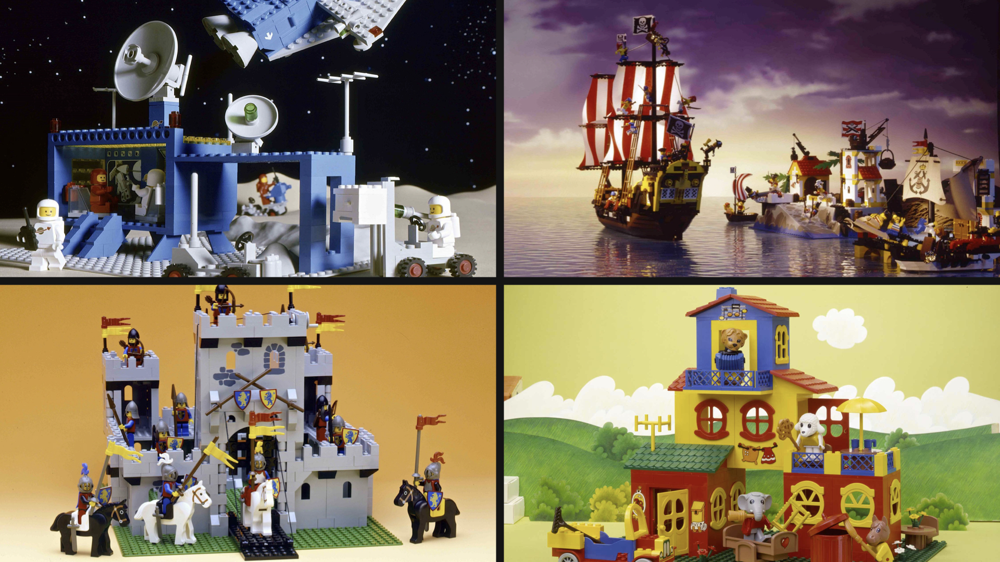

Since 1980 or so, when it launched the ‘LEGOLAND’ line of town and space themed sets, LEGO has also maintained distinct “themes” with their own distinctive building styles, color schemes, and even special parts.

Some of them make it back to other parts of the LEGO universe, like Castle-themed horses appearing in a LEGO Town “Stable,” or astronaut backpacks re-appearing as SCUBA tanks in an ocean set. But these themes have also served as “systems within a system” for ideas things that didn’t fit the rest of the LEGO world.

---

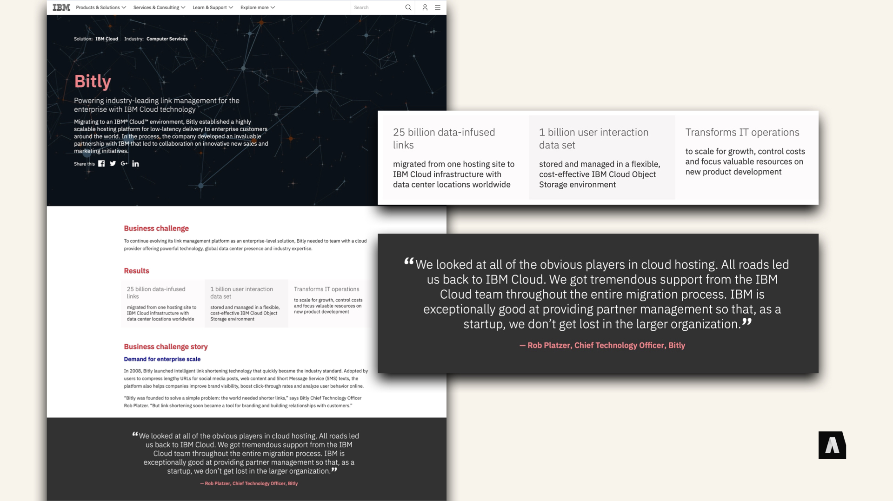

When IBM Cloud’s web team built out a new content type for “Case Studies,” that’s how it played out.

Case Studies followed most of the conventions of a normal article, but it added custom elements like pop-out pull quotes (which hadn’t really been used elsewhere on the site) and a type of call-out they ended up naming the “Data Proof.”
The Data proof in particular was meant to punctuate a case study with quick, digestible stats and numbers, demonstrating the effectiveness of the featured product.

Those content components were designed to use the same embedding and formatting mechanisms as the rest of the site’s content — but they were only used on case studies, at least initially. After some iteration and experimentation, the Data Proofs were tested in a few other types of content, and eventually integrated into the sitewide content model and design system.

Those kinds of “sandboxes” — as long as they remain compatible with the larger system — can make experimentation and iteration less destructive and more effective.

---

Real systems don’t stay static — when they’re used by real people in the real world, they get repurposed for new tasks, or new needs emerge, and pieces get adapted or added.

In linguistics, it’s called “drift.” A word that’s coined with one meaning, or grammatical rules that are clear in one era, can shift over time as they’re used and abused for other purposes — or practices from a dialect bleed back into larger language ecosystems.

---

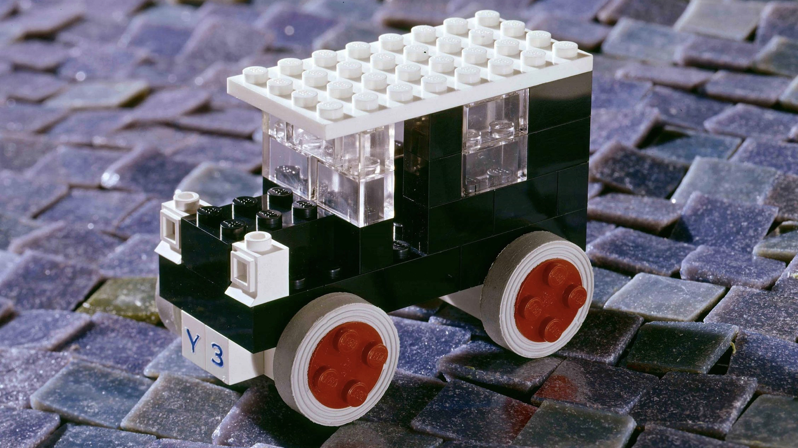

As special-purpose bricks go, the ‘wheel’ entered the LEGO universe pretty early. They appeared in some early “building kit” collections, but in 1963 LEGO set #315 — the “European Taxi” — was the first model to explicitly use them.

---

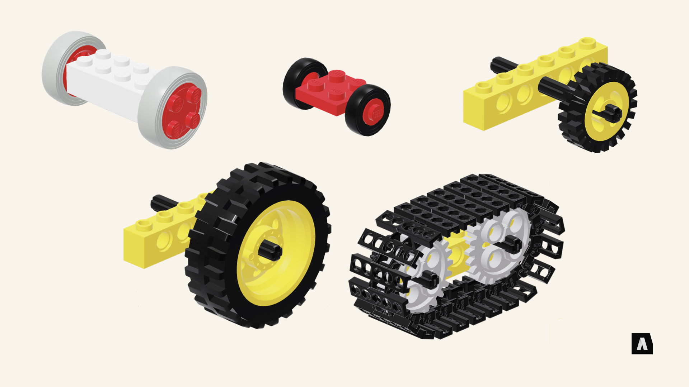

It was a pretty simple mechanism — a two-by-four brick had holes punched in its sides, a metal shaft connected to a round hub attached to the hole… and a grey rubber tire fit around the hub. Around 1965, they added a smaller version for the sets that used a different scale — but it hinted at a problem to come. They were starting to accumulate different, incompatible kinds of wheels — something that continued for several years.

In 1977, though, the TECHNIC theme’s new bricks with holes and matching axles made a new kind of wheel possible, one that leveraged more generic components that had been added to the system since wheels initially arrived. This style of wheel spread to the broader LEGO universe, where larger tires were added to meet the needs of new kits. Eventually, most kits moved to this system for wheels. Now, the same TECHNIC-derived mechanism is the basis of most of wheel-related things: different sized tires, axles with shock absorbers, even treads.

---

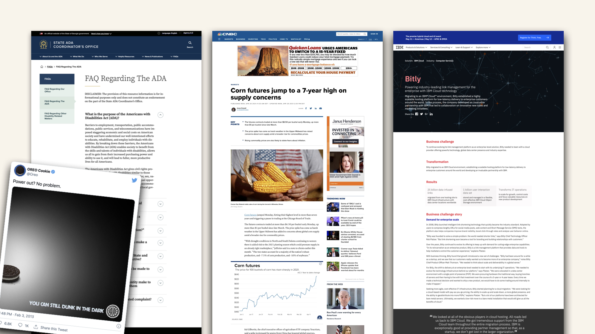

The key here is that they started simple, and when they spotted patterns emerging in different parts of the system, they iterated towards greater reuse of generic components and connections.

When a new need emerges in your content and messaging, you don’t have to reinvent the universe: find a simple solution, make it possible, and watch how it plays out in real world usage. Over time, you can discover how it’s best used and use your underlying system of connections and rules make it effective in other contexts.

That’s a theme that runs through most of the examples here — CNBC’s multi-purpose landing page tools, IBM’s Case Study components, Georgia’s system of pages-and-elements, Oreo’s perfectly timed tweet, and so on. None of the principles they’re using require them to figure out everything in advance. Whether it’s a clear brand voice for Oreo or a modular system of page components for CNBC, the approaches they’re taking and the structures they use allow them to improvise, and rely on a the consistency of an underlying system.

---

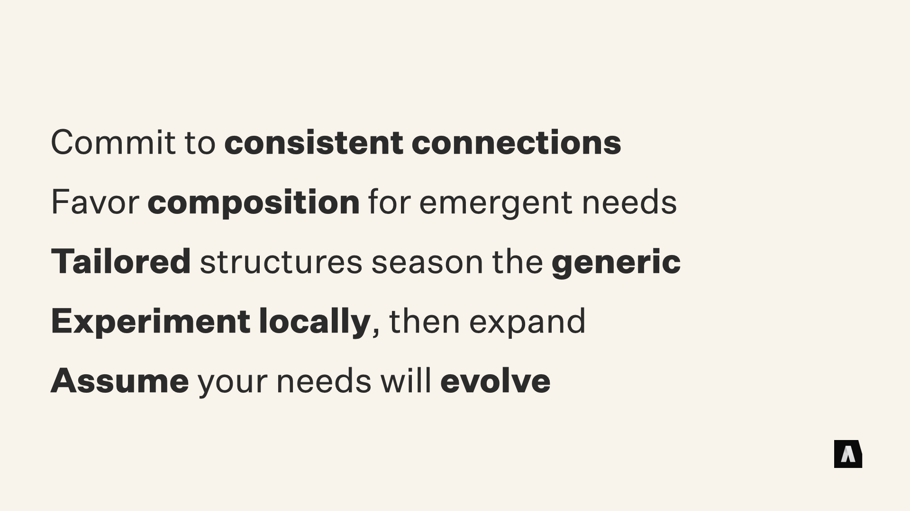

So. What are the takeaways from this foray into LEGO?

1. Commit to consistent connections and foundational properties for your content. Things you can count on all content sharing as you expand your system and do new things with it.
2. Favor composition for emergent needs, combining existing types of content rather than creating new kinds from scratch.
3. Use tailored, single-use content structures like “seasoning,” enhancing the meat-and-potatoes content that up the bulk of your library.
4. Experiment with new approaches in sandboxed subsets of your content system, where you can learn if it works and expand to the whole system if it does.
5. And finally, assume your needs will evolve. Trying to predict every need you’ll have in the distant future is brittle; it doesn’t account for the things you’ll learn along the way. Establishing systems with room to grow, and rules that ensure future additions work well with the early components, lets you adjust your course as you go.

---

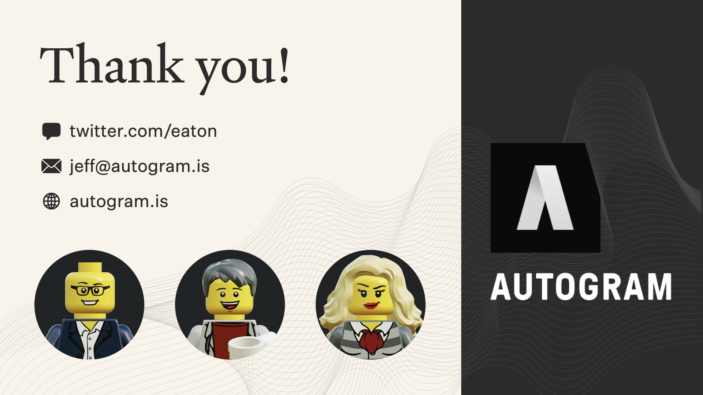

Thank you very much for your time; I hope it’s been useful, and If you’d like to see more of this kind of ranting, or you want to argue or talk shop or ideas, you can find me on Twitter, or check out our site at Autogram-I-S. We try to keep a feed of interesting stuff like this flowing, and — obviously — if you’ve got some tangly problems with your content, we’d love to work with you.
