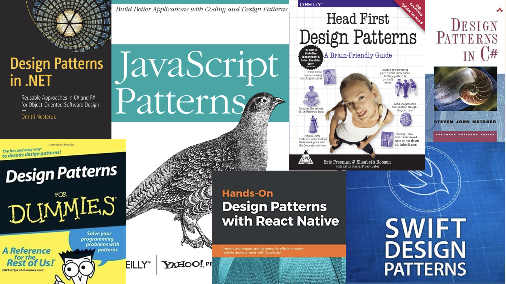
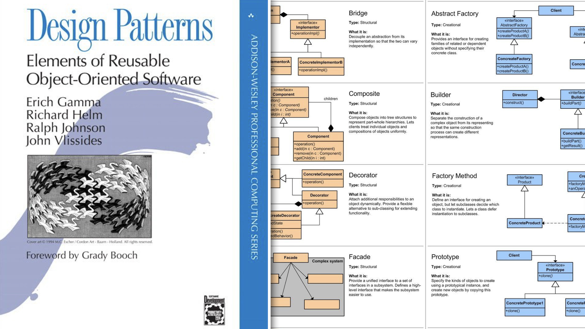
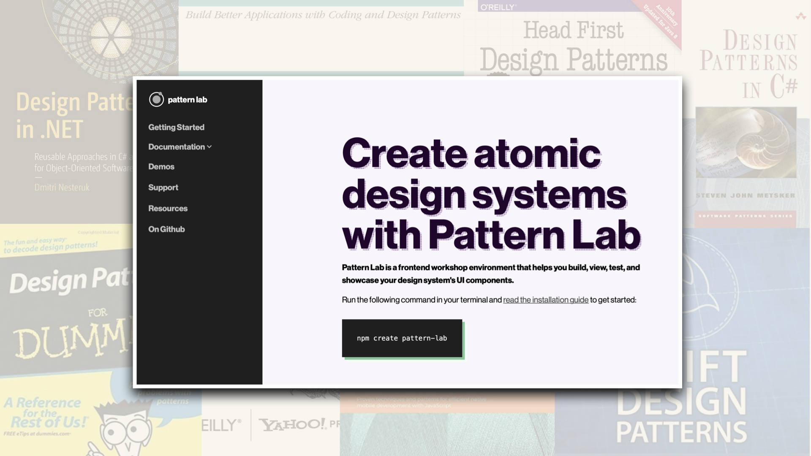
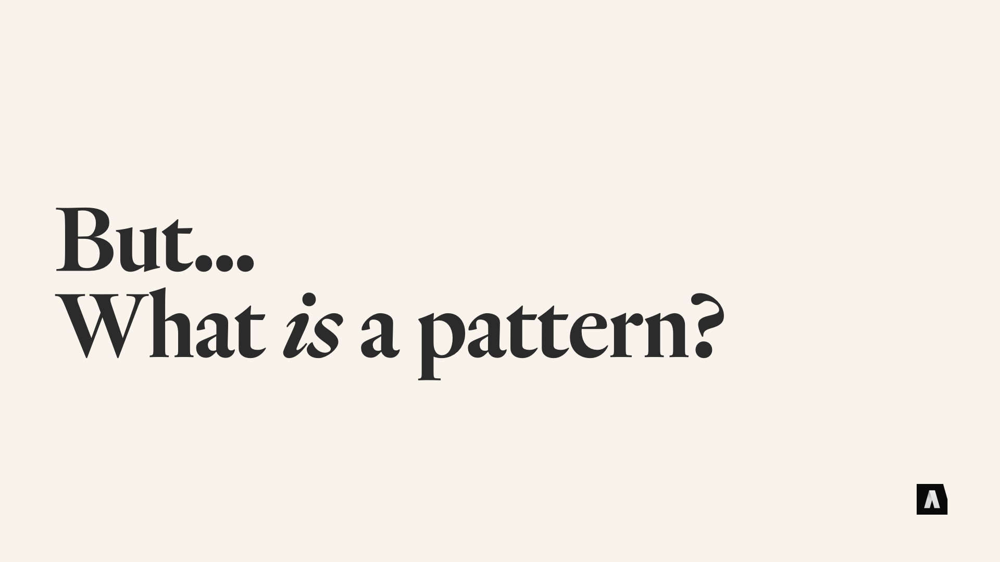
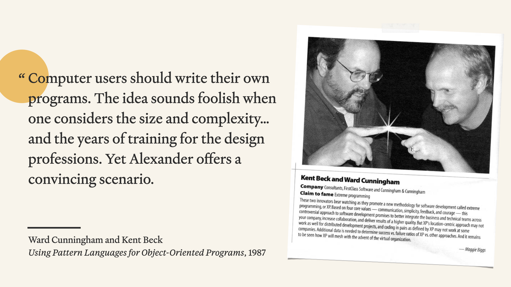
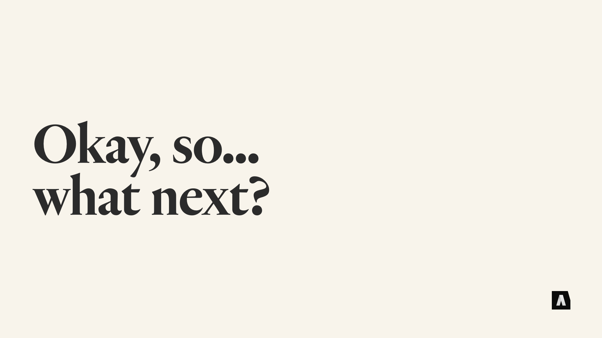
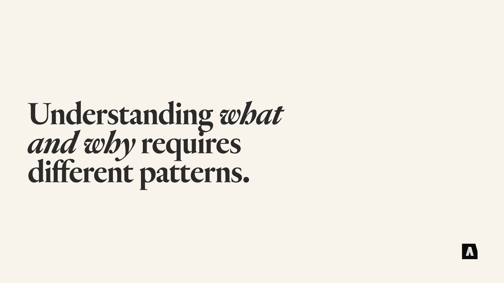
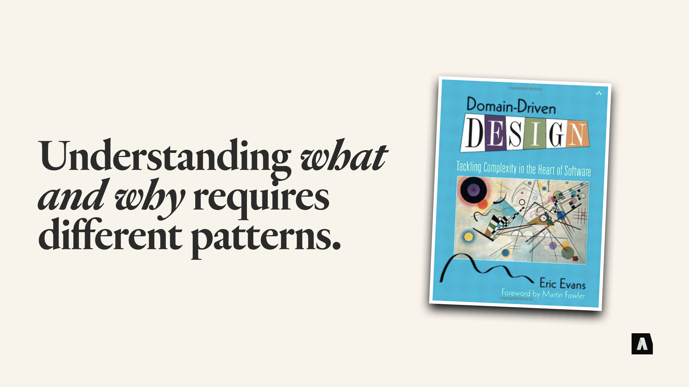

If you’ve been working with any kind of software development for the past few decades, you’ve encountered the concept of patterns. Depending on where in the stack you work the word might not be as familiar, but the concept is all over the place. Basically — common, named components that solve particular problems or do particular things, regardless of the programming language or framework they’re implemented in.

---

Over the past, say, twenty or thirty years “Patterns” have turned into… I’d say the most common way developers have of talking to each other about what they are building — about “breaking down software into smaller, easier-to-describe pieces,” and “reusing solutions from one piece of software in another.” I know folks who learn a new programming language or framework by building old, familiar patterns in the new environment. I know a lot of people who recommend junior devs “level up” by studying patterns.

---

The book that really put it on the map was 1994’s “Design Patterns.” The book was (and is) so ubiquitous that it’s often just called the “Gang of Four” book, after its four co-authors. It kind of explains the idea of a pattern, but most of its page count is used to describe a couple dozen specific patterns — things like “Factories” and “Facades” and “Decorators” and “Prototypes” — using UML diagrams and C source code. It was nerdy stuff, but it was also hugely influential: a lot of those building blocks were eventually baked into lots of frameworks and programming languages that followed it.

---

The really interesting part — in my opinion at least — is that this way of talking about things has become common in the UX and design communities, too. The idea of building a “pattern library” for your brand or your web app or your business is pretty common, and it’s often used interchangeably with the concept of a “design system,” which… is a definitional nitpick I won’t get into now, but can be fodder for a few weeks of Twitter yelling. But it’s definitely made the crossover from “programmer-specific concept” to “tech industry mental model.”

---

If you scratch the surface a bit, though, the crossover success of “The Pattern Pattern” isn’t shocking. Because that way of talking about recurring problems and solutions started in the world of physical architecture, not software architecture. “A Pattern Language” came out in 1977, and it was part of a cluster of books that architect Christopher Alexander either wrote or co-authored, talking about a philosophy of designing physical spaces that could be more timeless, could better serve the needs of the people who lived and worked in those spaces.

A great example is the idea of a Gradient of Privacy — ranging from open public spaces to private, intimate ones. The book describes a bunch of different patterns that capture ways of dialing that up or down: Parks, courtyards, foyers, living rooms, bedrooms, and so on.

The book describes specific patterns, but also the ways they work together to form homes or workplaces or neighborhoods or cities — and his intention was for the people who would eventually live or work or relax in a given place to use these patterns to talk to architects about what they wanted in a space. What they needed. That was the “Language” he envisioned, and if you’re a nerdy systems person, it’s really hard not to be inspired after reading it.

---

But… and there’s always a “but” with this kind of stuff… patterns aren’t without their problems. There are two particular conference talks that I think are worth checking out if you want to dig deeper into this: Mark Jason Dominus’ “Design Patterns Aren’t,” and Brian Marick’s “Patterns Failed, Why Should We Care?”

Both of them acknowledge how useful the idea of patterns is, and both of them are huge admirers of Alexander’s original Pattern Language work. But they also both argue that the idea of “Patterns” popularized by the Gang of Four book — the approach that’s become so ubiquitous in our industry — is something different entirely. Not necessarily something bad, but something closer to “developer shorthand” than Alexander’s rich idea.

---

Alexander’s patterns start with why and use named patterns to explain a particular what: Say, the idea that people need transitional spaces between open, exposed, public areas and the protected privacy of personal space. The patterns like Foyer, or  Courtyard, that it describes are ways of serving that need, ways of exploring solutions rather than dictating a particular construction method.

The Gang of Four book, on the other hand, tends to start with the what and describes a very specific how: Your program has a bunch different APIs and classes and other devs want a coherent interface for them: That calls for a Facade pattern, and here’s the code for it…

I got my start in “real” software development in the mid 90s and when the Gang of Four book was new and hot. On one of my first big projects, the software architect rolled in and said, “OK, we’re going to be building a new application, here are the six patterns you should read up on,” and tossed a sheaf of photocopied pages from the Gang of Four book at us green junior devs. “Patterns” really were being used as a kind of shorthand for complicated implementation details.

---

There was a “Pattern Language,” but it was a language developers could use to communicate with each other quickly about a system’s internals. But what it didn’t do was help us understand what was going on. Knowing that our software would use Abstract Factories, Iterators, and Dependency Injection didn’t tell me anything about our software, or what people would be doing with it, only about the code I was supposed to be writing.

That problem isn’t exclusive to the programming side of the fence, either — in the design systems and UX pattern world, it’s common to see designers treating “Patterns” as visual macros. Ways of quickly describing how different parts of the system look and behave, rather than what purpose they’re serving, and what job they’re doing for the person who will ultimately use it. Knowing that a given web app is will use “Pop-Ups” and “Heros” and “cards” and “rotators” might speed work for designers, but it doesn’t tell us much about what people will do with the finished product, and why.

---

The fascinating thing about this divide between “developer shorthand” and “language to talk about solutions”, is that you can see when it happened. Back in the mid 80s, Kent Beck and Ward Cunningham — who went on to do things like define “Agile” and invent “Wikis” — were talking about Christopher Alexander’s work and how it could improve the work of software development. And they had a very different take on what was going to be important about it.

In a 1987 paper they co-authored, they said “Computer users should write their own programs. The idea sounds foolish when one considers the size and complexity… and the years of training for the design professions. Yet Alexander offers a convincing scenario.” In their view patterns — like Alexander’s — were most useful for figuring out what should be made. A language for users and developers and designers to talk to each other about what the users needed and wanted.

---

So, okay. We’re now at the “takeaways” point. If there’s this big divide between “Why Patterns” and “How Patterns,” what does this mean for our work?

---

Personally, I think it’s a reminder, as we’re developing tools and ways of talking about complex work — a reminder to think hard about who we’re talking to. Is this thing I’m making a tool for developers or designers to talk to each other faster? Or is it a tool for different groups of people to talk to each other better?

That distinction has a big impact on the kinds of patterns we make and define. The “words” that we make for our shared language.

---

If you want to do some nerdy reading, I recommend checking out the Domain Driven Design community — they emphasize the idea of developing a “Ubiquitous Language” that developers, designers, and end users can use to talk to each other about what’s being created and how it needs to work. And — obviously! I’d highly recommend Alexander’s book “A Pattern Language.”

---

So… thank you very much for your time. If you’d like to see more of this kind of ranting, or you want to argue or talk shop or trade horror stories, you can find me on Twitter and check out our site at [autogram](https://autogram.is).

* [A Pattern Language (1977)](https://www.patternlanguage.com)
* [Design Patterns (1994)](https://www.gofpatterns.com)
* [Design Patterns Aren’t (2002)](https://perl.plover.com/yak/design/)
* [Domain Driven Design (2003)](https://www.amazon.com/dp/0321125215)
* [ Patterns Failed, Why Should We Care? (2017)](https://www.deconstructconf.com/2017/brian-marick-patterns-failed-why-should-we-care)
* [Kent Beck: My Lessons Learned (2018)](https://facebook.com/notes/kent-beck/my-personal-mission/1811782322187957/)
