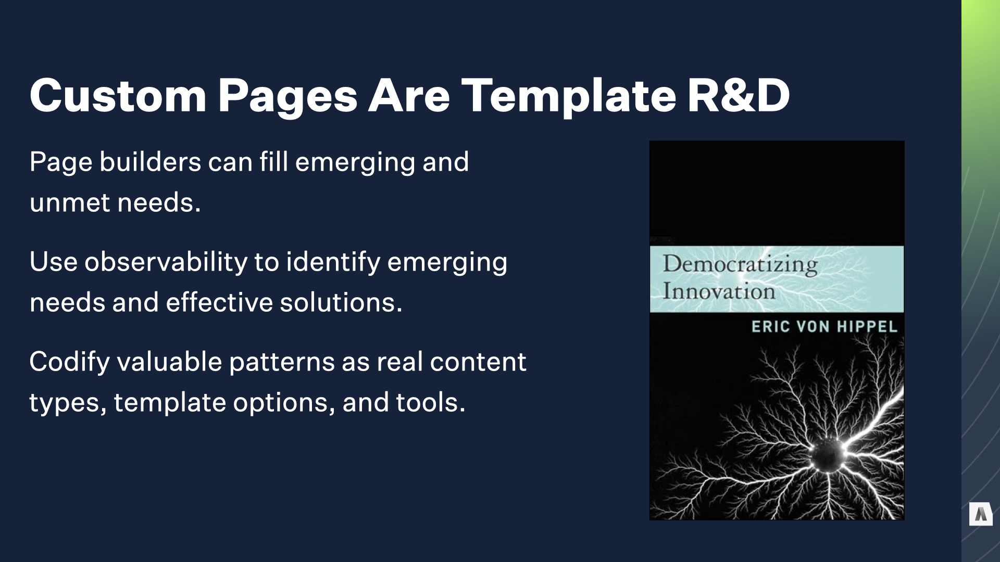

The central idea of this talk is that “modular page builders” can fill unanticipated publishing needs quickly, but at scale they destroy an organization’s ability to use and govern its own content.

The ubiquity of the approach has given producers tools that accelerate short-term construction tasks, but it also buries them in unmanageable output as time passes and complexity grows. Every single organization Autogram has worked with that adopted page building tools at scale is now wrestling with exploding production, maintenance, and migration costs for their content.

Helping them dig out is good money for us, but the problem is extremely bad for all of us collectively. The good news is that the it’s fixable. The bad news is that we have to dig into a few complicated bits to get there.

---

The classic, platonic view of structured content is leans heavily on identifying our types of content and their properties and their relationships.

This is an investment. You pour time with subject matter experts and stakeholders and developers and designers and CEOs taxonomists up front to define and produce this map of your content world, and it pays off over time as you create and deliver lots of it.

---

When you have a bunch of highly consistent content, it’s relatively easy to build a model for it, build some input forms, and pipe it through templates or feed it out through a content API. Obviously the devil is in the details, but it’s fair to say that things like “articles” and “staff bios” and “product pages” are basically a solved problem in the CMS world. You put in that investment, you define the structured model and build templates, and reap the rewards.

On the other hand, most sites have oddball edge cases that need special treatment, or have special functionality. Things like the home page, or the pricing calculator page, or a special for a seasonal campaign. It’s harder to justify the same rigorous content modeling and tool-building because they’re unique: you won’t be able to reuse that it across hundreds or thousands of other pieces of content. So you just “do it custom,” with weird HTML from the design agency or custom code from the dev team or a standalone microsite that doesn’t pollute the primary CMS.

As long as you don’t push into the upper right corner — where you need LOTS of highly variable content that burns design and developer hours — those approaches we’ve been polishing for decades work pretty nicely.

---

Of course, because nothing easy stays that way, there are a bunch of trends pushing organizations straight into that awkward, expensive upper-right quadrant.

The first is the acceleration inherent in today’s digital content ecosystem. In general, organizations are publishing more content, on shorter timelines, and there’s more competition for audience attention. That means there’s both more interest in experimenting with novel content, and less patience for long the long process of discovery, development, and rollout for CMS customizations.

On top of that is consolidation. Organizations want to reign in the complexity and expense of their infrastructure, teams that previously lived in their own tweaky CMS or whipped up microsites every month or two to support campaigns have been told to get with the program and migrate to The Official Company CMS. Suddenly, it has to deal with all of those edge cases. Events like business acquisitions, reorgs, and mergers also force disparate pools of content with different needs into the same system on short notice.

Finally, there’s an increasing expectation that all content — even stuff that used to be well-defined and strictly templated — should be eligible for high-touch design and customization. I’ve got this listed as the “Snowflake effect” but I’m also old enough to think of it as the Snowfall effect. About a decade ago, the NYT dropped a mind-blowing article about a some skiers who were trapped in an avalanche, weaving all kinds of rich media and interactive dataviz stuff into a narrative that could’ve been a simple text-with-photos article.

These aren’t the only reasons more content is being pushed into that expensive overlap, but they’re some of the most obvious. The key idea is that the comfortable divide “structured content types and templates” and “one-off special stuff” is steadily shrinking.

---

The question is: How does it get solved?

Target’s web presence is a nice example. Their corporate site had around 5000 to 6000 pages, with a mix of company news, influencer outreach, media assets, investor relations content, and “special” content for quarterly and yearly campaigns.

On the left here, we have a classic high-volume, high-consistency article. It’s got a hero banner and a photo, with some related posts piped into the sidebar. They’ve published thousands of them, and while they vary from article to article it’s all within a tightly defined range.

On the far right? Dynamic timeline of the company’s history. Custom stuff. It still made use of their design system and brand assets, but there’s only one page like this on the entire site and it was a custom design and development job for their CMS’s implementation team.

But in the middle there is one of their “campaigns.” It’s the landing page for their 2021 sustainability initiative, and it has a bunch of infographic treatments and pull quotes that their normal pages don’t use. The campaign is also a cluster of a few dozen pages, with its own dedicated nav menu rather than the system of tags and categories that drives their high-volume content.

Their campaigns have enough content that doing each page COMPLETELY from scratch would be too big of a lift, but they’re also too limited to justify building and implementing custom content types each quarter. After all, the NEXT campaign would be different, and they’d be back at square one.

---

Instead — and you probably saw this coming — they started with a “Generic Page” and assembled a custom design from scratch using different widgets in the CMS.

When the next campaign comes around, they’ll still have to build its pages from scratch… but they’ll be able to draw on the same inventory of building blocks, maybe get the devs to add one or two more, and assemble the new campaign with a different design using the same tools.

Over the past decade or so, this approach has emerged as  the most popular solution to that tension between consistent, high-volume content and one-off custom development. Officially there’s no standard name for it, but everybody calls it “the Page Builder,” and it has three defining features.

---

First, a Page Builder is self-service. The people working with it are end users of a CMS, content creators and producers. A key selling point for the approach is “No developers, no designers required”, which promises to lower expenses and accelerate delivery. It’s not always that simple, but we’ll get to that later.

Second, instead of giving users a fixed template or a field to fill with HTML, the page builder gives them a library of sub-page components, or widgets, or blocks, or slices, or modules, or blades, or planks. I’m pretty sure every company on Earth has made a special name for these pieces, but the idea is the same. In a lot of organizations, these parts are drawn from an existing design system or design pattern library, rather than designed from scratch for the CMS. We’ll get to that later, too.

Finally — and this is a critical bit — although the individual pieces might be big, small, simple, or complicated, the page itself doesn’t know much beyond about them All the page is responsible for is saying, “I contain a bunch of components, arranged by the author.”

Over the past five to ten years, every single CMS I know of has either built, announced, demo’d, or apologized for the lack of this kind of Page Builder. It’s a standard.

---

The critical point to remember, though, is that the page builder is fundamentally a CMS’s coping mechanism for a uncertain requirements.

When a page builder shows up in a sales demo, you hear about creative control and speed of execution and breaking the mold, but the reason those things are DIFFICULT without a page builder is that nobody had time to figure out what patterns and structures the content would require, model them, and build dedicated templates for them. When you’re not sure what you’re going to need to make, the Page Builder is your parachute.

The problem is that the parachute comes with some important tradeoffs.

---

A good structured content model makes at least two promises about every piece of content it applies to: What it is, and what it contains. That consistency makes it possible to FIND stuff in a big pool of content, to filter and categorize and update and manage it at scale.

Even at its best, the page builder model creates blind spots: custom pages with no inherent type and no predictable structure. Pages that you can see are THERE, but you don’t know why. At worst, this creates an explosion of exceptions to EXISTING structure that renders the site’s actual content model inconsistent and unreliable.

That’s especially common when the page builder is used to create “special” versions of otherwise templated content.

---

The second big drawback is that visual design — or more accurately, the collection of visual patterns the page builder allows users to choose from — becomes the de facto content model.

In theory, it’s possible to create a page builder whose individual components are clean, reusable content modules with inherent meaning. In reality, the vast majority of teams go straight to an existing visual pattern library or component system. Then authors — instead of composing content and capturing what it is, or what it’s for — stack those visual components into page containers and fill out each component’s placeholder fields. Headless has the same problem — nothing keeps you from firing up contentful or sanity and making a model that bakes design decisions deep into the structure.

The result is content locked in the shape of the visual patterns, like oldschool jpegs sliced to fit into table cells. In addition to slowing down content updates and making reuse nigh impossible, that means design components can’t be changed or updated without breaking all of the content that’s been “baked into them” across hundreds or thousands of pages.

---

The page builder’s big value proposition is that it’s supposed to make production faster and simpler. By giving CMS users complete structural flexibility and control over design decisions, it eliminates expensive developers and designers. Years back, Dries Buytaert of Acquia even declared that his goal was to “eliminate Drupal developers” with these kinds of tools.

Ironically, they usually result in more complexity for content producers, because the list of design components keeps growing to meet new needs, and individual components get tweaky options to support more edge cases.

One of my favorite examples is a component that appeared on almost every page of one client’s site. That ONE design component had over 70 distinct fields to fill out. About a third were required. Consistency became a huge problem, because individual producers couldn’t remember every tweak their particular department used as a “house style.”

For all that hassle, the result was a single hero image with a CTA button.

---

So… before I get too deep into my lament here, it’s worth asking: are these drawbacks really THAT bad? If Page Building tools WORK, we can forgive an awful lot of philosophical disagreements about how they structure their content. Instead of raw HTML and custom markup, you’ve got consistent modular components with structured content inside each one. Instead of requests to IT for a new page type, and a bunch of conversations about ‘data requirements,’ you just start clicking and assembling things.

And — this is important — the Page Builder only really needs to be used for special pages, right? That’s why is was created. On paper, that’s all true. If the page builder approach was only crowding out truly custom stuff, it would probably be a net benefit. A good solution.

But in every organization we’ve seen roll out these tools, once the page-building hammer is in hand, lots of content management and publishing challenges start to look like nails: more and more content begins to be built with it, even the stuff that used to be handled with structured content types and templates.

---

The reason why is pretty straightforward. It’s a lot of work to build and support a system of modular components, along with the editorial tools to assemble them in arbitrary ways to fill new and unpredictable needs. Once you have that built and populated with components, it makes sense to use it for other things — to make the most of it.

So, while the growing for large quantities of unpredictably-structured content might DRIVE a team to build or buy a modular page-building tool, once they HAVE it, those mystery meat pages start creeping into other squares of the quadrant, too.

The first target is usually the low-volume custom stuff — that was always a drag. The really unique elements of those pages might still require custom development, but your developers build new widgets for the page builder, rather than entirely new pages and templates.

Pretty soon the simple, consistent stuff that you only had a few of — your terms of service, stuff like that — catches your eye. You could use dedicated content types and templates for those, but why support those extras?

And once you’ve gone that far, when the time comes to do something a bit different with one of your existing high-volume templated content types, like spruce up a product page, the answer seems pretty clear.

---

Those are totally reasonable decisions, but the end result is a kind of inevitable gravity pulling content towards the page building tool, eating away at the effectiveness of the structured content tools that give a consolidated CMS platform a lot of its utility.

All because we wanted to solve a problem that annoyed everyone.

---

In 1967, a Fullbright Scholar named Marie Clay worked with challenging students: seven and eight year olds who struggled to build basic reading skills. Traditional early-reading tools were failing them, and she was determined to figure out a better way.

---

Since the 1600s or so, early English literacy had been built on a foundation of spoken language. The letters of the alphabet each have a sound, and given a set of letters you can chain the sounds together to form a spoken word. That approach is called phonics, and the idea of “sounding out a word” an unfamiliar word is based on it. In theory, it leverages the spoken vocabulary kids already have to unlock written language before they tackle spelling and grammar and other critical skills.

Traditionally, this approach relied on a lot of rote memorization and drills -- and that's where Marie saw her students getting bogged down. Her big breakthrough came from observing the techniques that helped them make it past the grind of that rote memorization.

---

When they encountered new words, rather than sound them out letter by letter, Marie's students learned to treat it like a problem-solving game: Did they recognize any other words that started with “G?" What word might make sense based on the rest of the sentence? What word might make sense given pictures in the book, or other parts of the story? With a teacher to help them when they were stumped, her students could expand their vocabularies and unlock the joy of reading much more quickly.

The curriculum she developed — "Reading Recovery" — was a runaway success. By the 80s it spread from New Zealand to the UK and the US, and with along with similar programs by other educators and researchers grew into a program that could help EVERY student learn to read faster, not just the ones that were having trouble. By the 1990s, it was a core part of education reform programs in the US and a lot of educators were treating phonics as a thing of the past.

---

The only problem was, it was a huge mistake. The "Reading Recovery" approach accelerated early reading, but as years passed, students who'd learned its techniques showed signs of trouble.

Kids who took naturally to reading or whose parents paid for afterschool tutors often did okay, which isn't a huge shock. But many others hit a wall around age twelve or thirteen, when schoolwork grew more complex and the guessing games they'd used to learn words from illustrated storybooks dragged their reading to a crawl.

The amazing new tool to unlock the joy of reading was turning into a crisis; students were graduating from high school unable to read newspapers or instructions: basic text was a painful, painstaking puzzle.

---

With the help of new brain imaging technologies and language research, the problem started to become clear. The boring basics — phonetic connections between spoken sounds and individual written letters — are actually critical for real fluency with complex material. Puzzle-solving, clue-hunting tactics aren’t inherently bad, but they aren’t really READING, and they don’t scale.

With the best of intentions, the system's proponents had taken a set of coping mechanisms poor readers used to get by, and turned them into the Way Things Should Be Done. It took years of academic and political battles to turn the tide back, and at least in the US it's still contentious: Hundreds of professional reputations, huge investments in educational programs, years of publishers' profits from curriculum were all at stake.

---

I mentioned earlier that Karen McGrane, Ethan Marcotte, and I have been chewing on this problem a lot in our work at Autogram.

Our overlapping backgrounds — editorial UX, strategy and governance… content architecture and engineering… design and design systems — those different complimentary backgrounds meant that for years, each of us had been seeing these problems from different angles with different clients.

---

When we started comparing notes, it was kind of breathtaking. Since we founded Autogram, every single client we’ve worked with has come to us with an exploding inventory of “mystery meat” page builder content.

---

The costs of this explosion are real.

Those clients can’t deliver content quickly because they’re buried in complex design choices, building even simple content from scratch over and over.

They can’t reuse content assets they spent time and money to create, because the meaningful structures are chopped into chunks of visual layout.

They can’t test or personalize at scale, because there are no consistent semantic structures to target or leverage - just stuff, in places.

They can’t measure meaningful outcomes, because there’s no clear idea of why any piece of content was made, or why it was constructed in a particular way.

And they can’t touch the design system without starting over, because changing the components breaks all the content the uses them.

---

For most of these companies, the tangible consequences fall on the teams maintaining the content. They’re eternally behind the ball and struggling to keep up. If they’re lucky, they get the headcount they need to stay on top of things. More realistically their inability to deliver as quickly as the vendor promised is held over their heads and they get ulcers.

Some organizations give up on finding value in the mystery meat they’ve built and just start over. IBM’s Director of Digital, Bryan Casey, has been giving public updates during his year-long effort to axe 80% of IBM’s hundreds of thousands of pages of marketing content. It’s a testament to his dedication and skill that he’s managed to accomplish that with no hit to IBM’s organic traffic. But he’s the first to acknowledge that they’ll never know how much valuable content they tossed; all they could really measure was traffic.

Finally, and this is the one that I think should put the fear of god into everybody, a lot of orgs just come to the conclusion that the CMS they were sold sucks, and they should get a new one. They hire a new CMO and run a bakeoff and they get themselves a new page builder, because that’s what everybody’s selling and that’s what everybody wants, and they blame the NEW CMS in three years when the cycle repeats.

Circle of life.

---

When I talk to vendors, they say “Hey, this is what everyone asks for.” And to some extent that’s true. But it’s also what those clients are being sold. They come in with problems, and this is what they’re told will solve them. Page builders demo well. They let the bakeoff team avoid unpredictable complexity in favor of “just add your design patterns.” It pushes the consequences into the hazy, post-launch future.

I mean, to be clear, nobody does it out of spite — like I said at the beginning of the talk, this approach evolved to solve real problems. We identified a scenario where our “mature solutions” were falling short; we invested in promising solutions, and with varying degrees of enthusiasm we turned them into The New Way Things Are Done. It’s taken time, but the consequences of that shift are here and they’re serious. And we have to start fixing it.

---

We know the culprit: modular page building tools that crowd out structured, templated content with mystery meat in the name of “flexibility.”

We know what’s breaking, and how: the purpose and contents of each page is obscured, the visual shape of each design pattern ends up taking the place of a real content model, ad the complexity of those decisions ends up swamping the promised productivity gains.

We know what it’s costing us: the ability to build common stuff quickly, the ability to measure and manage content at scale, the ability to iterate on design and site organization without breaking everything, and (in the case of vendors and agencies) it also costs the goodwill of customers who bought into this approach on our advice.

---

The question is, how do we fix it? There’s no one answer, but we’re going to walk through the core techniques that we start with.

---

The absolute first priority is eliminating that “mystery meat” problem that we talked about early on. If you don’t know what kinds of content you have, and and what information is inside of those pieces of content, the whole process of managing and governing content falls apart.

---

If you’re building a new site from scratch, or migrating from a legacy system, one of the first big steps is an inventory of your content and an audit to better understand it.

When you’re staring at thousands of mystery meat pages, even if you’re not changing CMSs you need to bite the bullet and do the audit. Even if it’s section by section, there’s no way around it.

At Autogram we often work with really, really huge sites — hundreds of thousands of pages across dozens of domains and different CMSs. We actually built a custom web crawler for ourselves just to automate this process. If your CMS can’t generate a clear initial inventory for you, tools like Screaming Frog SEO (or Spidergram, it’s open source!) are incredibly valuable for automating the initial grunt work..

Your goal here isn’t to make final decisions about the content, just getting a better understanding of it.

---

Although it’s ultimately important, asking “what content type should this page be?” is often a mistake until until you have the big, BIG picture. You can sink a lot of time into carving out new content types and arguing about fields without really clarifying the deeper question: “What is this piece of content here for? What outcome is it expected to achieve?”

We worked with Charles Schwab, a financial services firm, as they were acquiring Ameritrade, another giant company in the same industry. They had two complete, overlapping content models with different terminology and conventions. Some was page builder content but even with clearly modeled types they faced some of the same inconsistency and overlap problems.

Working with them to establish a taxonomy of shared intentions that could be used to examine all the content, regardless of source or shape, helped us find related and complimentary clusters of content, as well as stuff that was doing really well or really poorly. That INFORMED what got migrated, and how things were mapped to final, concrete content types.

---

This isn’t a one-shot deal; the goal is to get a better understanding of what’s there, why it’s there, and whether it’s succeeding — exactly the stuff that runaway page builder usage obscures.

Getting this information may not be possible using just your CMS; monitoring things like user task completion, contribution to brand perception, and so on rely on more complex mixes of data. But if you start by capturing the underlying intention of a given page, the thing it’s supposed to be accomplishing, you can iterate on the specific data that’s used to measure it.

---

---

Once you’ve ironed out the mystery meat problem, and you understand what you have and what it’s for, consolidating custom pages into more explicitly modeled content types is possible.

Sometimes you’ll be able to map stuff to simple content types with fixed templates, but often they still need SOME flexibility in what they contain, how they’re presented, and so on. The question is, what techniques can you use

---

Design isn’t a decorative layer; it’s an additional tool for communicating meaning. Before giving content creators direct visual control, first look at what they’re trying to communicate with those visual tools. Often, it’s much more effective to let them capture the choice itself — what should be emphasized, what content comes next in a sequence, etc — and leave it up to the design system to translate that meaningful choice into visual presentation.

This is a quick snapshot from the MSNBC.com news section: they wanted to have layout and design variations they could use when different aspects of a story were particularly compelling: a great pull quote, or a striking photo, or a memorable video clip.

In the final model we created for them, every story can have supporting elements like pull quotes or media or infographics, but the editor can choose which element should be emphasized. That choice is then passed along to the design system, which uses it to switch between several different full-page and teaser templates.

The editor isn’t choosing a layout, they’re choosing what to emphasize, or what comes next. The design system can change and evolve, but the underlying editorial intent is preserved.

---

---

Eric Von Hippel’s book: if you’re building and maintaining a system that’s used by other people, discovering and understanding their needs is expensive and difficult.

When they have tools to push the boundaries, they can fill their own needs, and you can monitor what they’re doing to identify opportunities for system-wide improvements before those people even know how to articulate them.

But you NEED that to be a system with guardrails that prevents the “experimentation” from bleeding into the more carefully built stuff.

---

So far we’ve been talking about ways to organize and simplify. For a lot of projects that’s actually enough: Assuming that ‘Page builders are a coping mechanism for unclear requirements,’ the auditing work and more flexible templating approaches help us by bringing some of those requirements into focus and expanding how much “give” we have to fill new requirements without going all the way to “mystery meat.”

But. Sometimes there’s no getting around it. You really do need users to build ANYTHING by clicking together pieces. What then? How do we deal with that complexity?

---

There’s no way around this kind of complexity, but we can learn how to do some things better by looking at how actual languages work.

Mark Baker’s book Structured Writing: Rhetoric And Process is one of the best undiscussed books on content modeling in in this context, because it treats structure as the meaningful parts of a particular message, not just the data properties of a particular named entity. This is particularly critical when we’re dealing with fuzzy, hard-to-pin down content types.

---

One of the core features of a fully developed language is grammar; it categorizes words by the roles they can play in sentences.

Words aren’t just free-floating atoms that get dumped into a sentence together. Their order and position in relation to each other affect the meaning of the composition. The first sentence, for example, is about a boy and what he’s doing. The second sentence is about a horse and what’s happening to it.

The third sentence is valid but absurd: it uses the system of relationships between the different words to communicate something we wouldn’t expect.

Finally, the fourth sentence is gibberish; we can identify the pieces but it’s unclear what’s being said, because it doesn’t play by the rules of English grammar.

---

The idea isn’t to build your content model around actual parts of english sentences. It’s to think through how the combinatorial relationships work together to accomplish complex communication work.

---

I’ll stop now, because I can rant about this for a long, long time. But I genuinely believe skimping on this “language-like complexity” is one of the reasons visual page builders go terribly wrong, and why composable content stymies a lot of organizations who try to do it at scale.

---

---

Additional reading:

* [A Web Page Is A Stack Of Containers](https://containerist.org)
* [The Battle for the Body Field](https://alistapart.com/article/battle-for-the-body-field)
* [How Teaching Kids to Read Went So Wrong](https://features.apmreports.org/sold-a-story)
* [Measuring Docs In a Product-Docs System](https://passo.uno/docs-observability-do11y)
* [Structured Writing: Rhetoric and Process](https://xmlpress.net/publications/structured-writing)
* [Democratizing Innovation](https://mitpress.mit.edu/9780262720472)
* [Design by Definition](https://abookapart.com/products/design-by-definition)
* [Expressive Design Systems](https://abookapart.com/products/expressive-design-systems)
